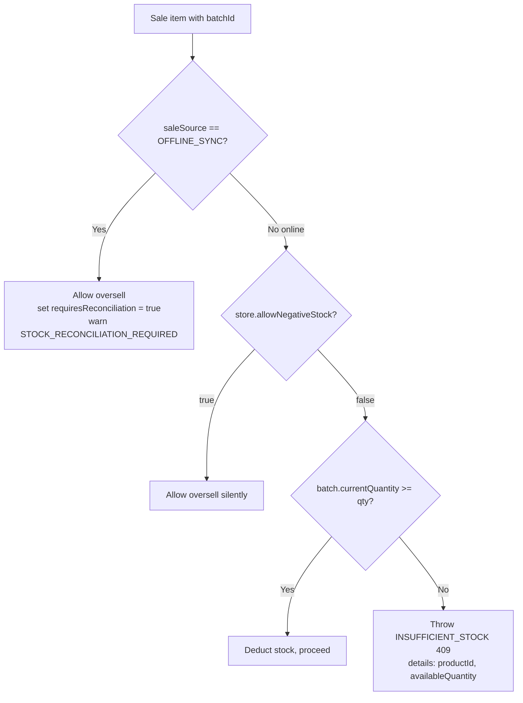

# ADR 0004: Sales Transaction Rules (Stock, Invoicing, Idempotency, Audit)

## Status

Accepted

## Date

2026-07-11

## Context

The POS sale creation path (`POST /sales`) and offline sync path (`POST /sync/sales`)
are the highest-risk flows in SaleSense: they move money, stock, and generate legal
invoices. While finishing the sales module we found the service implemented the happy
path but had drifted from the contracts already specified in the system design, database
model, and API docs.

This ADR records the **decisions** (and the reasoning behind each) so the rules are not
re-litigated by any human or AI contributor, and so they read consistently across tools.
Related design sources: `system-design/0001`, `database/0002`, `api/0001`, `api/0002`,
`adr/0003`.

## Decision

### 1. Stock handling differs by sale source (online blocks, offline reconciles)

- **Online sale**: block overselling with `INSUFFICIENT_STOCK` (HTTP 409) unless the
  store has opted into `allowNegativeStock`.
- **Offline sync**: never block. A sale already happened at the counter; the server
  accepts it, sets `requiresReconciliation = true`, writes an audit entry, and returns a
  `STOCK_RECONCILIATION_REQUIRED` warning.

**Why (RCA):** A completed customer transaction must not be rejected retroactively just
because server-side stock looks short after the fact — that would strand real cash sales.
But live, connected billing *should* prevent accidental oversell, which is a data-entry
mistake, not a completed offline sale. The `saleSource` enum is the discriminator; the
`allowNegativeStock` store flag is the explicit escape hatch for shops that bill faster
than they reconcile stock.

### 2. Invoice numbering uses the Indian financial year (April–March)

- Financial year label is `YYYY-YYYY` (e.g. `2026-2027`), computed by
  `getIndianFinancialYear()`: months Jan–Mar belong to the previous start year.
- Numbering is per `(storeId, financialYear)` via an atomic `invoiceSequence.upsert`.

**Why (RCA):** Indian GST/retail invoicing resets and is reconciled by the April–March
financial year, not the calendar year. Using `new Date().getFullYear()` produced wrong
year labels and would have reset numbering three months early every January.

**Known limitation:** the FY is derived from server local time; near the midnight-April-1
IST boundary a UTC server can be off by hours. A timezone-aware fix (store timezone + tz
library) is deferred to avoid adding dependencies now.

### 3. Idempotency: unique constraint + pre-check + race fallback

- Client supplies an idempotency key; the sale is uniquely constrained on
  `(storeId, idempotencyKey)`.
- The service pre-checks for an existing sale and returns it on replay.
- If two identical requests race past the pre-check, the loser catches the Prisma `P2002`
  unique violation and returns the winning sale instead of a 500.

**Why (RCA):** Offline-first billing retries aggressively; double-billing is unacceptable.
The DB unique constraint is the source of truth; the pre-check and P2002 fallback make
replays and concurrent retries return the original sale rather than erroring.

**Deferred:** the full `idempotency_keys` table with `requestHash` (to detect *same key /
different body* → `IDEMPOTENCY_CONFLICT`) is designed but not yet wired.

### 4. Every sale writes an audit log

Each successful sale writes an `audit_logs` row (`action: SALE_CREATED`) inside the same
transaction, with safe metadata only (`invoiceId`, `idempotencyKey`) — never payment
secrets or full payloads (per `adr/0003`).

### 5. `requestId` comes from the request pipeline, not ad-hoc strings

Controllers read the correlation id via `@RequestId()` (populated by
`RequestIdInterceptor`) and pass it down to be persisted as `createdRequestId` and in
audit logs. Ad-hoc `req_${Date.now()}` strings are not allowed.

## Implementation Status

| Rule | Status |
| --- | --- |
| Online `INSUFFICIENT_STOCK` guard + `allowNegativeStock` bypass | Implemented |
| Indian-FY invoice numbering | Implemented |
| Idempotency pre-check + P2002 race fallback | Implemented |
| `SALE_CREATED` audit log | Implemented |
| `requestId` from interceptor | Implemented |
| Offline `requiresReconciliation` + `sync_events` + warnings + documented sync response shape | Implemented |
| `idempotency_keys` table + `requestHash` / `IDEMPOTENCY_CONFLICT` | Deferred |

## Consequences

- Live billing is protected from accidental oversell; offline sales are never lost.
- Invoices are legally correct for the Indian FY and safe under concurrent billing.
- Sales are traceable end-to-end via `requestId` and audit logs.
- Cost: two intentionally different stock code paths (online vs sync) that must stay in
  sync with this ADR; the sync path still needs Workstream B to fully honor rule 1.

## Revisit When

- Weighted/loose quantities require non-integer stock math.
- Multi-counter concurrency makes the P2002 fallback insufficient and we need the full
  `idempotency_keys` table.
- Stores operate across time zones and FY-boundary correctness matters to the hour.
