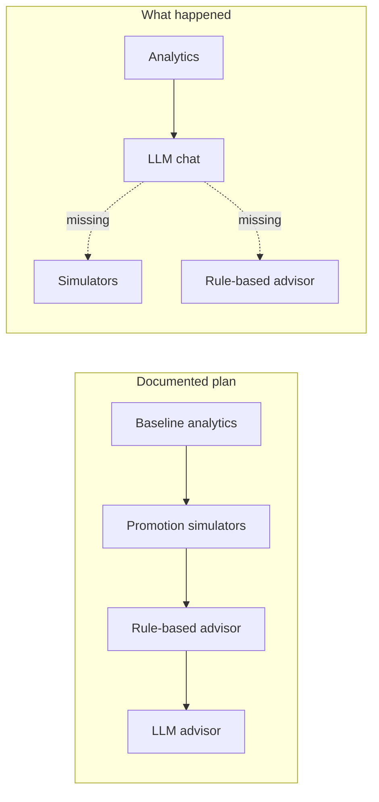

# ADR 0005: Phase 4 Sequencing and Analytics Corrections

## Status

Accepted

## Date

2026-07-11

## Context

`api/0001-api-design-v1.md` specified the Phase 4 order: reliable baseline analytics →
promotion **simulators** (the stated differentiator) → **rule-based** advisor → LLM
advisor. It said explicitly: *"Do not build LLM advisor endpoints until baseline
analytics and simulator data are reliable."*

What was actually built (commit `8b57daa`) was the opposite end first: analytics
aggregation + a Gemini **LLM chat**, with no simulators and no rule-based advisor.
Forensics showed why: the agent worked from the stale README summary ("aggregation +
AI integration") rather than the design docs, and `system-design/0004` was written
*after* the code in the same commit — post-hoc documentation, not a plan. No decision
to reorder was ever recorded.

## Decision

1. **Keep the built LLM chat.** It is architecturally sound (store-scoped context
   injection, RBAC, graceful degradation) and already shipped. Removing working code to
   satisfy document order would be waste. It is reclassified as an *early-delivered
   slice* of the final Phase 4 step.
2. **Re-adopt the documented sequencing for all remaining Phase 4 work:**
   - **P4.0** Harden existing analytics (correctness + tests) — this ADR's corrections.
   - **P4.1** Close the reconciliation loop (`GET /inventory/reconciliation`, resolve
     endpoint, expiry/reconciliation counts in inventory health).
   - **P4.2** Promotion simulators (`/simulators/discount`, `/simulators/bogo`).
   - **P4.3** Rule-based advisor (`/advisor/recommendations`).
   - **P4.4** Deepen the LLM advisor with simulator/recommendation data.
3. **Process guardrail:** a mandatory pre-flight workflow was added to the root
   `AGENTS.md` (read design docs before building; never silently deviate from an ADR;
   design doc before code). `CLAUDE.md` and `GEMINI.md` pointer files ensure agents that
   look for their own entry files land on the same rulebook.

## P4.0 Corrections (why each)

| Correction | Why (RCA) |
| --- | --- |
| Revenue chart keys change from `MMM dd` to ISO `yyyy-MM-dd`, sorted | `MMM dd` merges the same day of different years and relies on insertion order; ISO keys sort correctly and are unambiguous. Frontend formats for display. |
| Daily grouping uses `Store.timezone` (via `Intl.DateTimeFormat`, zero new deps) | Grouping by server-local time puts late-evening IST sales on the wrong day when the server runs UTC. The store timezone field existed but was unused. |
| Dead-stock `lockedValue` computed at **purchase cost**, not selling price | Locked capital is what you paid, not hoped-for revenue. Retail-value inflation overstated the problem by the margin. |
| AI chat gains a validated DTO (required string, max length 2000) | `@Body('message')` was unvalidated: empty bodies hit Gemini, and unbounded input is an API-cost exposure. |
| Real unit tests for all analytics methods | Test-strategy release rule: no feature is complete without automated tests. The spec files were stubs. |
| Orphaned debug scripts removed (`fetch-test.js`, `fetch-test-models.js`, `test.js`, `test-ai.ts`) | Debris from the original Gemini debugging session; verified unreferenced. |
| `GEMINI_API_KEY` documented in `.env.example` | It was a real config input missing from the template. |

## Implementation Status

| Step | Status | Commit / Doc |
| --- | --- | --- |
| P4.0 Analytics hardening + agent governance | ✅ Done | `2e80233`; corrections table above |
| P4.1 Reconciliation loop | ✅ Done | `814df71`; `system-design/0005` |
| P4.2 Promotion simulators | ✅ Done | `system-design/0006` (incl. plan-vs-implementation delta) |
| P4.3 Rule-based advisor | ⏳ Next | design doc required before code |
| P4.4 Deepen LLM advisor | Pending | after P4.3 |

## Consequences

- Phase 4 proceeds in a defensible order with the differentiator (simulators) next in
  line after reconciliation.
- Analytics numbers become timezone-correct and year-safe before the LLM reasons over
  them or simulators build on them.
- The AGENTS.md pre-flight gate makes doc-first the default for every future agent
  session; the residual risk is an agent ignoring the file, which prompting should
  reinforce ("follow AGENTS.md") at session start.

## Revisit When

- Analytics volume forces materialized views (see `database/0002` read-model notes).
- Simulators need promotion CRUD (currently deferred behind the simulator itself).
- Multi-timezone chains make per-request timezone resolution a performance concern.
