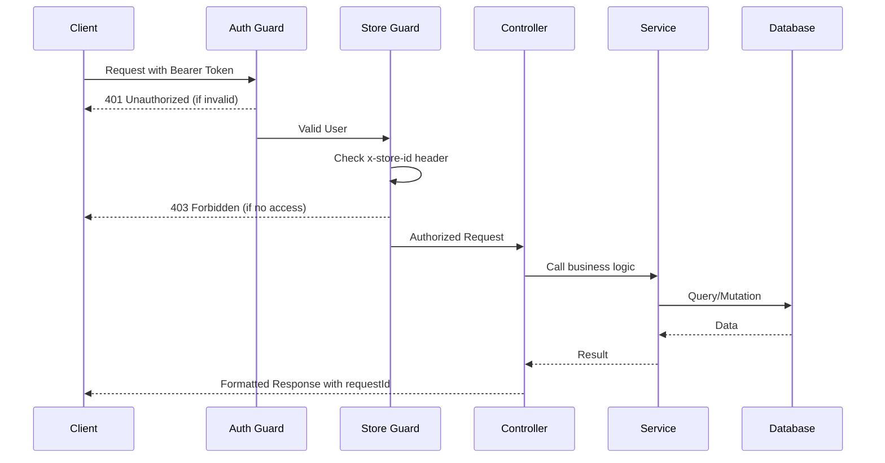
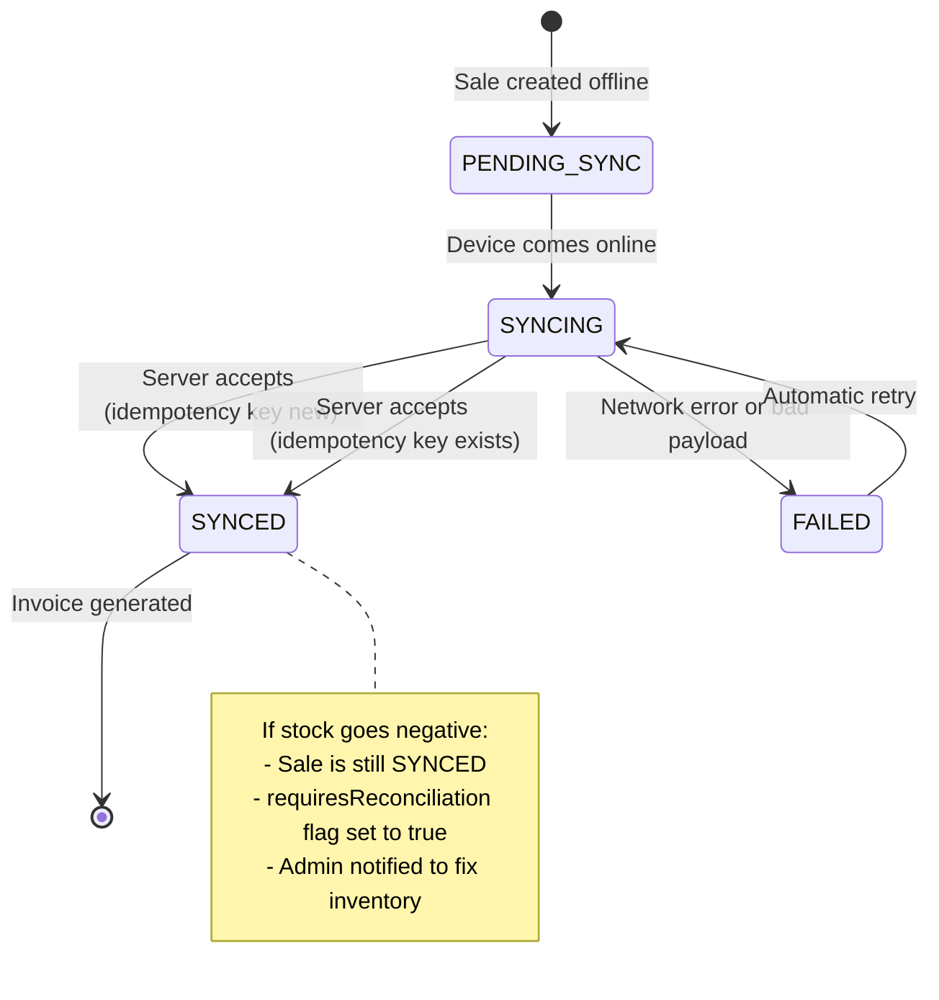

# API Design v1

## Status

Draft for review

## Goal

Define the first stable API surface for SaleSense before implementation. The API must support the MVP flows from the system design and database model: auth, store access, product catalog, inventory, purchases, POS billing, invoices, payments, refunds, offline sync, analytics, and audit-friendly observability.

## Design Principles

1. Keep controllers thin; business rules live in services.
2. Every tenant-owned resource is scoped by `storeId`.
3. Use stable error codes and a standard response shape.
4. Use idempotency for sale creation, invoice creation, refund actions, and offline sync.
5. Use integer paise for all money values.
6. Do not expose internal database fields unnecessarily.
7. Preserve historical sale and invoice snapshots.
8. Return `requestId` in every API response.
9. Use OpenAPI/Swagger generated from NestJS decorators.
10. Keep MVP endpoints boring and reliable; add advanced APIs later.

### API Request Flow



## Implementation Errata (2026-07-13)

Route drift between this design and the implemented API, recorded per the pre-flight
rule (checklist item 7):

| Designed | Implemented |
| --- | --- |
| `/purchase-orders*` | `/purchases*` (receive: `PATCH /purchases/:id/receive`) |
| `POST /sync/sales` | `POST /sales/sync` |
| `GET /invoices/:id/receipt` + `/pdf` | Single `GET /invoices/:id` carries the full receipt payload; PDF lives on the public share route `GET /public/receipts/:token/pdf` (design 0009 Gate 2) |
| `POST /simulators/*`, `/advisor/recommendations` | As designed |

## Base URL

```text
/api/v1
```

Future breaking changes should use `/api/v2`.

## Authentication

MVP recommendation:

- Email/password or phone/password login.
- API uses access token plus refresh token/session strategy.
- Exact auth library can be finalized during implementation, but the API should expose a stable auth contract.

### Auth Endpoints

| Method | Endpoint | Purpose | Roles |
| --- | --- | --- | --- |
| `POST` | `/auth/login` | Login user | Public |
| `POST` | `/auth/logout` | Logout current session | Authenticated |
| `POST` | `/auth/refresh` | Refresh session/token | Public with refresh credential |
| `GET` | `/auth/me` | Current user and store memberships | Authenticated |

## Headers

| Header | Required | Purpose |
| --- | --- | --- |
| `Authorization: Bearer <token>` | Protected routes | Auth |
| `x-request-id` | Optional | Client-provided request correlation |
| `x-store-id` | Protected store routes | Active store context |
| `idempotency-key` | Required for write-sensitive routes | Duplicate prevention |

If `x-request-id` is missing, the API generates one and returns it.

## Standard Success Response

For object responses:

```json
{
  "success": true,
  "data": {},
  "requestId": "req_01jz..."
}
```

For list responses:

```json
{
  "success": true,
  "data": [],
  "pagination": {
    "page": 1,
    "pageSize": 25,
    "total": 100
  },
  "requestId": "req_01jz..."
}
```

Counterpoint: some teams prefer returning raw JSON without `success`. For this app, the envelope is useful because the frontend can handle errors, `requestId`, and pagination consistently.

## Standard Error Response

```json
{
  "success": false,
  "error": {
    "code": "PRODUCT_NOT_FOUND",
    "message": "Product was not found.",
    "details": null
  },
  "requestId": "req_01jz..."
}
```

See `api/0002-api-contracts.md` for the detailed error and idempotency rules.

## Pagination And Filtering

Default list query parameters:

| Parameter | Purpose |
| --- | --- |
| `page` | 1-based page number |
| `pageSize` | Number of records, default 25, max 100 |
| `q` | Search text |
| `status` | Optional status filter |
| `sortBy` | Whitelisted sort field |
| `sortOrder` | `asc` or `desc` |

For large audit/sales timelines, cursor pagination can be added later.

## Role Access

| Role | General Access |
| --- | --- |
| `OWNER` | Full store access |
| `MANAGER` | Products, inventory, purchases, sales, refunds approval, reports |
| `CASHIER` | POS billing, product lookup, invoice print/share, limited refunds request |

Detailed permissions should be enforced by guards/policies, not scattered inside controllers.

## Store Management

| Method | Endpoint | Purpose | Roles |
| --- | --- | --- | --- |
| `GET` | `/stores` | List stores current user can access | Authenticated |
| `POST` | `/stores` | Create store | Owner onboarding |
| `GET` | `/stores/:storeId` | Get store details | Owner, Manager |
| `PATCH` | `/stores/:storeId` | Update store profile/settings | Owner |
| `GET` | `/stores/:storeId/users` | List store users | Owner, Manager |
| `POST` | `/stores/:storeId/users` | Invite/add user | Owner |
| `PATCH` | `/stores/:storeId/users/:userId` | Change role/status | Owner |

### Store User Invitation Flow

```mermaid
flowchart TD
    A[Owner clicks 'Add Team Member'] --> B{User exists by email/phone?}
    B -->|Yes| C[Direct Add: Create StoreUser]
    B -->|No| D[Create StoreInvitation (PENDING)]
    D --> E[User registers/logs in]
    E --> F[Show pending invitations]
    F --> G{User accepts?}
    G -->|Yes| H[Create StoreUser & mark ACCEPTED]
    G -->|No| I[Mark invitation REJECTED]
```

## Devices

| Method | Endpoint | Purpose | Roles |
| --- | --- | --- | --- |
| `POST` | `/devices/register` | Register browser/PWA/counter device | Authenticated |
| `PATCH` | `/devices/:deviceId/heartbeat` | Update last seen | Authenticated |
| `GET` | `/stores/:storeId/devices` | List store devices | Owner, Manager |

## Product Catalog

### Categories

| Method | Endpoint | Purpose | Roles |
| --- | --- | --- | --- |
| `GET` | `/categories` | List categories for active store | Owner, Manager, Cashier |
| `POST` | `/categories` | Create category | Owner, Manager |
| `PATCH` | `/categories/:categoryId` | Update category | Owner, Manager |
| `DELETE` | `/categories/:categoryId` | Archive category | Owner, Manager |

### Brands

| Method | Endpoint | Purpose | Roles |
| --- | --- | --- | --- |
| `GET` | `/brands` | List brands | Owner, Manager, Cashier |
| `POST` | `/brands` | Create brand | Owner, Manager |
| `PATCH` | `/brands/:brandId` | Update brand | Owner, Manager |
| `DELETE` | `/brands/:brandId` | Archive brand | Owner, Manager |

### Products

| Method | Endpoint | Purpose | Roles |
| --- | --- | --- | --- |
| `GET` | `/products` | List/search products | Owner, Manager, Cashier |
| `POST` | `/products` | Create product | Owner, Manager |
| `GET` | `/products/:productId` | Product detail | Owner, Manager, Cashier |
| `PATCH` | `/products/:productId` | Update product defaults | Owner, Manager |
| `DELETE` | `/products/:productId` | Archive product | Owner, Manager |
| `GET` | `/products/barcode/:barcode` | Lookup product by barcode | Owner, Manager, Cashier |
| `POST` | `/products/:productId/barcodes` | Add product barcode | Owner, Manager |
| `DELETE` | `/products/:productId/barcodes/:barcodeId` | Remove barcode | Owner, Manager |

Example product create body:

```json
{
  "name": "Amul Milk 500ml",
  "sku": "MILK-AMUL-500",
  "barcode": "8900000000012",
  "categoryId": "cat_...",
  "brandId": "brand_...",
  "hsnCode": "0401",
  "taxRateBps": 500,
  "mrpPaise": 3200,
  "sellingPricePaise": 3000,
  "trackInventory": true,
  "expiryTracked": true
}
```

## Inventory

| Method | Endpoint | Purpose | Roles |
| --- | --- | --- | --- |
| `GET` | `/inventory` | Current stock by product/batch | Owner, Manager |
| `GET` | `/inventory/products/:productId/batches` | Product batch stock | Owner, Manager, Cashier |
| `GET` | `/inventory/movements` | Stock movement history | Owner, Manager |
| `POST` | `/inventory/adjustments` | Manual stock correction | Owner, Manager |
| `GET` | `/inventory/reconciliation` | Items needing stock review | Owner, Manager |
| `POST` | `/inventory/reconciliation/:movementId/resolve` | Resolve stock reconciliation | Owner, Manager |

Manual adjustments must create `stock_adjustments`, `stock_movements`, and `audit_logs`.

## Purchases

| Method | Endpoint | Purpose | Roles |
| --- | --- | --- | --- |
| `GET` | `/suppliers` | List suppliers | Owner, Manager |
| `POST` | `/suppliers` | Create supplier | Owner, Manager |
| `PATCH` | `/suppliers/:supplierId` | Update supplier | Owner, Manager |
| `GET` | `/purchase-orders` | List purchase orders | Owner, Manager |
| `POST` | `/purchase-orders` | Create draft purchase | Owner, Manager |
| `GET` | `/purchase-orders/:purchaseOrderId` | Purchase detail | Owner, Manager |
| `POST` | `/purchase-orders/:purchaseOrderId/receive` | Receive stock into inventory | Owner, Manager |
| `POST` | `/purchase-orders/:purchaseOrderId/cancel` | Cancel draft purchase | Owner, Manager |

Receiving a purchase must create inventory batches and stock movements in one transaction.

## POS Sales

| Method | Endpoint | Purpose | Roles |
| --- | --- | --- | --- |
| `POST` | `/sales` | Create online sale | Owner, Manager, Cashier |
| `GET` | `/sales` | List sales | Owner, Manager |
| `GET` | `/sales/:saleId` | Sale detail | Owner, Manager, Cashier |
| `POST` | `/sales/:saleId/cancel` | Cancel sale if allowed | Owner, Manager |

`POST /sales` requires `idempotency-key`.

Example sale create body:

```json
{
  "customerId": null,
  "deviceId": "dev_...",
  "clientSaleId": "local_sale_001",
  "items": [
    {
      "productId": "prod_...",
      "batchId": "batch_...",
      "quantity": 2,
      "unitSellingPricePaise": 3000,
      "discountPaise": 0
    }
  ],
  "payments": [
    {
      "method": "CASH",
      "amountPaise": 6000
    }
  ]
}
```

Sale creation must:

1. Validate store access.
2. Validate idempotency key.
3. Load product and batch data.
4. Calculate subtotal, discount, tax, total, and profit server-side.
5. Create sale and sale items.
6. Create stock movements.
7. Create payment records.
8. Generate invoice number and invoice.
9. Write audit log.
10. Return sale, invoice, and print-ready receipt data.

## Invoices

| Method | Endpoint | Purpose | Roles |
| --- | --- | --- | --- |
| `GET` | `/invoices/:invoiceId` | Invoice detail | Owner, Manager, Cashier |
| `GET` | `/invoices/:invoiceId/receipt` | Print/thermal receipt data | Owner, Manager, Cashier |
| `GET` | `/invoices/:invoiceId/pdf` | PDF invoice when supported | Owner, Manager, Cashier |
| `POST` | `/invoices/:invoiceId/cancel` | Cancel invoice if allowed | Owner, Manager |

MVP can return receipt data before full PDF generation exists.

## Payments

| Method | Endpoint | Purpose | Roles |
| --- | --- | --- | --- |
| `GET` | `/payments` | List payments | Owner, Manager |
| `POST` | `/sales/:saleId/payments` | Add payment to sale | Owner, Manager, Cashier |
| `PATCH` | `/payments/:paymentId` | Update payment reference/status | Owner, Manager |

Dynamic UPI payment verification is not MVP unless we choose a payment provider.

## Refunds

| Method | Endpoint | Purpose | Roles |
| --- | --- | --- | --- |
| `POST` | `/sales/:saleId/refunds` | Request refund | Owner, Manager, Cashier |
| `GET` | `/refunds` | List refunds | Owner, Manager |
| `GET` | `/refunds/:refundId` | Refund detail | Owner, Manager |
| `POST` | `/refunds/:refundId/approve` | Approve refund | Owner, Manager |
| `POST` | `/refunds/:refundId/reject` | Reject refund | Owner, Manager |
| `POST` | `/refunds/:refundId/complete` | Complete approved refund | Owner, Manager |

Cashier can request a refund, but manager or owner approval is required before completion.

## Offline Sync

| Method | Endpoint | Purpose | Roles |
| --- | --- | --- | --- |
| `POST` | `/sync/sales` | Sync offline sales | Owner, Manager, Cashier |
| `GET` | `/sync/events` | List sync events | Owner, Manager |
| `GET` | `/sync/events/:syncEventId` | Sync event detail | Owner, Manager |

`POST /sync/sales` accepts one or more offline sales and must be idempotent per client mutation.

If stock is insufficient during sync:

- create/sync the sale
- create stock movement
- set `requiresReconciliation = true`
- create audit log
- return a warning in the response

Example sync response:

```json
{
  "success": true,
  "data": {
    "synced": [
      {
        "clientMutationId": "mut_001",
        "saleId": "sale_...",
        "invoiceId": "inv_...",
        "status": "SYNCED",
        "requiresReconciliation": true,
        "warnings": [
          {
            "code": "STOCK_RECONCILIATION_REQUIRED",
            "message": "Sale synced, but stock is now negative for one item."
          }
        ]
      }
    ],
    "failed": []
  },
  "requestId": "req_01jz..."
}
```

### Offline Sync Lifecycle Flow



## Customers

| Method | Endpoint | Purpose | Roles |
| --- | --- | --- | --- |
| `GET` | `/customers` | List/search customers | Owner, Manager |
| `POST` | `/customers` | Create customer | Owner, Manager, Cashier |
| `GET` | `/customers/:customerId` | Customer detail | Owner, Manager |
| `PATCH` | `/customers/:customerId` | Update customer | Owner, Manager |

Customer phone remains optional.

## Analytics

| Method | Endpoint | Purpose | Roles |
| --- | --- | --- | --- |
| `GET` | `/analytics/summary` | Daily/monthly sales summary | Owner, Manager |
| `GET` | `/analytics/revenue` | Revenue trends | Owner, Manager |
| `GET` | `/analytics/profit` | Profit trends | Owner, Manager |
| `GET` | `/analytics/top-products` | Top-selling products | Owner, Manager |
| `GET` | `/analytics/dead-stock` | Slow/dead stock | Owner, Manager |
| `GET` | `/analytics/inventory-health` | Low/expired/reconciliation stock | Owner, Manager |

MVP analytics can query operational tables directly. Add materialized views later only if performance requires it.

## Promotions And Simulators

| Method | Endpoint | Purpose | Roles |
| --- | --- | --- | --- |
| `POST` | `/simulators/discount` | Discount profitability calculation | Owner, Manager |
| `POST` | `/simulators/bogo` | BOGO profitability calculation | Owner, Manager |
| `GET` | `/promotions` | List promotions | Owner, Manager |
| `POST` | `/promotions` | Create promotion draft | Owner, Manager |
| `PATCH` | `/promotions/:promotionId` | Update promotion | Owner, Manager |

Counterpoint: promotion CRUD can wait until after the simulator if we want a smaller MVP. The simulator is the differentiator, so it should be prioritized before a complex promotion campaign engine.

## AI Advisor Placeholder

| Method | Endpoint | Purpose | Roles |
| --- | --- | --- | --- |
| `POST` | `/advisor/recommendations` | Rule-based recommendations first | Owner, Manager |
| `POST` | `/advisor/forecast` | Future demand forecasting | Owner, Manager |

Do not build LLM advisor endpoints until baseline analytics and simulator data are reliable.

## Audit And Support

| Method | Endpoint | Purpose | Roles |
| --- | --- | --- | --- |
| `GET` | `/audit-logs` | List audit events | Owner |
| `GET` | `/audit-logs/:auditLogId` | Audit detail | Owner |

Audit endpoints must mask sensitive metadata.

## OpenAPI Documentation

NestJS should expose generated docs at:

```text
/docs
```

Requirements:

- group endpoints by module
- document roles and required headers
- document error codes
- document idempotency behavior
- include example requests/responses for billing and sync flows

## Next Step

After this API design is reviewed, create:

1. DTO contract notes for critical endpoints
2. OpenAPI conventions
3. Implementation scaffold for `apps/api`

