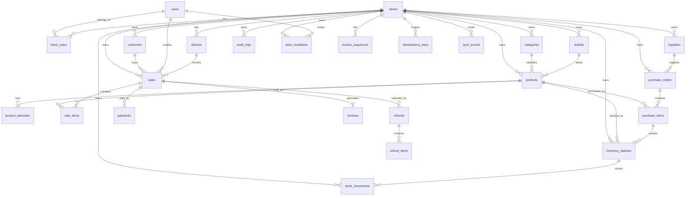

# Database Model v1

## Status

Draft for review

## Goal

Design a PostgreSQL data model for SaleSense that supports MVP features without blocking future growth. The model must support product catalog, inventory batches, purchases, POS billing, invoices, payments, offline sync, idempotency, audit logs, analytics, and multi-store expansion.

## Design Principles

1. Make the schema multi-store ready from day one.
2. Keep the MVP UI single-store if needed.
3. Store money as integer minor units, such as paise.
4. Do not use floating point for money.
5. Change stock only through `stock_movements`.
6. Preserve historical prices on sales and purchase records.
7. Use idempotency keys for sale and invoice creation.
8. Store request traceability for high-risk business records.
9. Keep GST optional per store, but model tax fields early.
10. Prefer soft status fields over hard deletion for business records.

## Recommended Decisions

| Topic | Recommendation | Why |
| --- | --- | --- |
| Store model | Multi-store ready, MVP can expose one store | Avoid painful tenant migration later |
| Invoice numbering | Per store, per financial year | Common retail/GST expectation and easier reconciliation |
| GST | Optional per store | Some small shops may not have GST at launch |
| UPI QR | Static merchant QR in MVP, dynamic amount QR later | Faster MVP, easier payment flow |
| Offline stock check | Warn when stock is uncertain, do not hard block by default | Offline billing should keep business running |
| Request ID persistence | Persist on audit/sync/idempotency and high-risk records | Debug billing and inventory issues |
| Money fields | `amountPaise` integer fields | Avoid rounding bugs |
| Product deletion | Archive products instead of deleting | Preserve invoices and analytics |
| MVP roles | `OWNER`, `MANAGER`, `CASHIER` | Keep MVP simple while allowing future roles |
| Refund approval | Manager/owner approval required | Refunds affect cash, inventory, and audit trail |
| Customer phone | Optional | Invoice can be printed without customer contact details |
| Product catalog scope | Store-specific in MVP, global catalog-ready later | Keep MVP simple while allowing barcode auto-fill in future |
| Offline insufficient stock | Allow sync and mark for reconciliation | Completed customer sales should not be blocked later |

## Core Entity Groups

| Group | Tables |
| --- | --- |
| Tenant and users | `users`, `stores`, `store_users`, `devices` |
| Product catalog | `categories`, `brands`, `products`, `product_barcodes` |
| Inventory | `inventory_batches`, `stock_movements`, `stock_adjustments` |
| Purchases | `suppliers`, `purchase_orders`, `purchase_items` |
| Sales and invoices | `customers`, `sales`, `sale_items`, `payments`, `invoices`, `invoice_sequences`, `refunds`, `refund_items` |
| Promotions | `promotions`, `promotion_rules` |
| Offline and reliability | `idempotency_keys`, `sync_events` |
| Observability and audit | `audit_logs` |

## High-Level ERD



## Tenant And Users

### `users`

Stores login identity and profile information.

| Field | Type | Notes |
| --- | --- | --- |
| `id` | uuid/string | Primary key |
| `name` | string | User display name |
| `email` | string nullable | Unique when present |
| `phone` | string nullable | Unique when present, mask in logs |
| `passwordHash` | string | Not returned to clients |
| `status` | enum | `ACTIVE`, `DISABLED` |
| `createdAt` | datetime |  |
| `updatedAt` | datetime |  |

### `stores`

Represents a shop, branch, or retail location.

| Field | Type | Notes |
| --- | --- | --- |
| `id` | uuid/string | Primary key |
| `name` | string | Store name |
| `gstNumber` | string nullable | Optional in MVP |
| `addressLine1` | string nullable |  |
| `addressLine2` | string nullable |  |
| `city` | string nullable |  |
| `state` | string nullable |  |
| `pincode` | string nullable |  |
| `upiId` | string nullable | Static UPI QR in MVP |
| `currency` | string | Default `INR` |
| `timezone` | string | Default `Asia/Kolkata` |
| `allowNegativeStock` | boolean | Default false, can be used for offline reconciliation |
| `status` | enum | `ACTIVE`, `DISABLED` |
| `createdAt` | datetime |  |
| `updatedAt` | datetime |  |

### `store_users`

Joins users to stores with roles.

| Field | Type | Notes |
| --- | --- | --- |
| `id` | uuid/string | Primary key |
| `storeId` | fk |  |
| `userId` | fk |  |
| `role` | enum | `OWNER`, `MANAGER`, `CASHIER` |
| `status` | enum | `ACTIVE`, `DISABLED` |
| `createdAt` | datetime |  |

Constraint: unique `(storeId, userId)`.

Future role scope: add roles such as `ACCOUNTANT`, `AUDITOR`, or `SUPPORT` later through enum expansion or a permission table if role behavior becomes more granular.

### `devices`

Represents browser/PWA installations, counters, tablets, or owner phones.

| Field | Type | Notes |
| --- | --- | --- |
| `id` | uuid/string | Primary key |
| `storeId` | fk |  |
| `name` | string | Example: `Counter 1` |
| `type` | enum | `COUNTER`, `MOBILE`, `TABLET`, `ADMIN` |
| `clientGeneratedId` | string nullable | Stable local PWA/device ID |
| `lastSeenAt` | datetime nullable |  |
| `createdAt` | datetime |  |

## Product Catalog

### `categories`

| Field | Type | Notes |
| --- | --- | --- |
| `id` | uuid/string | Primary key |
| `storeId` | fk |  |
| `name` | string |  |
| `parentId` | fk nullable | Future nested categories |
| `status` | enum | `ACTIVE`, `ARCHIVED` |
| `createdAt` | datetime |  |

Constraint: unique `(storeId, name)`.

### `brands`

| Field | Type | Notes |
| --- | --- | --- |
| `id` | uuid/string | Primary key |
| `storeId` | fk |  |
| `name` | string |  |
| `status` | enum | `ACTIVE`, `ARCHIVED` |
| `createdAt` | datetime |  |

Constraint: unique `(storeId, name)`.

### `products`

Product master data. Pricing fields are current defaults only; historical prices live on sale and purchase rows.

| Field | Type | Notes |
| --- | --- | --- |
| `id` | uuid/string | Primary key |
| `storeId` | fk |  |
| `globalProductId` | string nullable | Future link to a master catalog product |
| `categoryId` | fk nullable |  |
| `brandId` | fk nullable |  |
| `sku` | string nullable | Unique per store when present |
| `name` | string |  |
| `description` | string nullable |  |
| `hsnCode` | string nullable | GST invoice support |
| `taxRateBps` | integer | Basis points, example 18 percent = `1800` |
| `mrpPaise` | integer nullable | Current MRP |
| `sellingPricePaise` | integer | Current default selling price |
| `trackInventory` | boolean | Default true |
| `expiryTracked` | boolean | Default false |
| `status` | enum | `ACTIVE`, `ARCHIVED` |
| `createdAt` | datetime |  |
| `updatedAt` | datetime |  |

Constraints:

- unique `(storeId, sku)` where `sku` is not null
- index `(storeId, name)`
- index `(storeId, categoryId)`
- index `(globalProductId)` for future catalog matching

### `product_barcodes`

Allows multiple barcodes for one product.

| Field | Type | Notes |
| --- | --- | --- |
| `id` | uuid/string | Primary key |
| `storeId` | fk | Denormalized for scoped uniqueness |
| `globalBarcodeId` | string nullable | Future link to a master catalog barcode |
| `productId` | fk |  |
| `barcode` | string | Scanner value |
| `isPrimary` | boolean |  |
| `createdAt` | datetime |  |

Constraint: unique `(storeId, barcode)`.

## Inventory

### `inventory_batches`

Represents a purchased batch or stock lot.

| Field | Type | Notes |
| --- | --- | --- |
| `id` | uuid/string | Primary key |
| `storeId` | fk |  |
| `productId` | fk |  |
| `purchaseItemId` | fk nullable | Batch source |
| `batchNo` | string nullable | Supplier/manufacturer batch |
| `purchasePricePaise` | integer | Cost per unit |
| `mrpPaise` | integer nullable | MRP at purchase time |
| `sellingPricePaise` | integer | Selling price assigned to batch |
| `expiryDate` | date nullable |  |
| `initialQuantity` | integer | Quantity received |
| `currentQuantity` | integer | Current quantity available |
| `status` | enum | `ACTIVE`, `EXHAUSTED`, `EXPIRED`, `ARCHIVED` |
| `createdRequestId` | string nullable | Traceability |
| `createdByUserId` | fk nullable |  |
| `createdAt` | datetime |  |
| `updatedAt` | datetime |  |

Indexes:

- `(storeId, productId)`
- `(storeId, expiryDate)`
- `(storeId, status)`

### `stock_movements`

The source of truth for stock changes.

| Field | Type | Notes |
| --- | --- | --- |
| `id` | uuid/string | Primary key |
| `storeId` | fk |  |
| `productId` | fk |  |
| `batchId` | fk nullable | Some adjustments may be product-level |
| `type` | enum | `PURCHASE_IN`, `SALE_OUT`, `REFUND_IN`, `ADJUSTMENT_IN`, `ADJUSTMENT_OUT`, `TRANSFER_IN`, `TRANSFER_OUT` |
| `quantityDelta` | integer | Positive or negative |
| `quantityAfter` | integer nullable | Useful for audit/debug |
| `requiresReconciliation` | boolean | True when offline sync creates uncertain or negative stock |
| `referenceType` | enum | `PURCHASE`, `SALE`, `REFUND`, `ADJUSTMENT`, `TRANSFER`, `SYNC` |
| `referenceId` | string | ID of source record |
| `reason` | string nullable | For adjustments |
| `createdRequestId` | string nullable | Traceability |
| `createdByUserId` | fk nullable |  |
| `createdAt` | datetime |  |

Indexes:

- `(storeId, productId, createdAt)`
- `(storeId, referenceType, referenceId)`
- `(storeId, createdRequestId)`

### `stock_adjustments`

Records manual stock corrections.

| Field | Type | Notes |
| --- | --- | --- |
| `id` | uuid/string | Primary key |
| `storeId` | fk |  |
| `productId` | fk |  |
| `batchId` | fk nullable |  |
| `quantityDelta` | integer |  |
| `reason` | string | Required |
| `createdByUserId` | fk |  |
| `createdRequestId` | string nullable |  |
| `createdAt` | datetime |  |

## Purchases

### `suppliers`

| Field | Type | Notes |
| --- | --- | --- |
| `id` | uuid/string | Primary key |
| `storeId` | fk |  |
| `name` | string |  |
| `phone` | string nullable | Mask in logs |
| `gstNumber` | string nullable |  |
| `address` | string nullable |  |
| `status` | enum | `ACTIVE`, `ARCHIVED` |
| `createdAt` | datetime |  |

### `purchase_orders`

| Field | Type | Notes |
| --- | --- | --- |
| `id` | uuid/string | Primary key |
| `storeId` | fk |  |
| `supplierId` | fk nullable |  |
| `invoiceNumber` | string nullable | Supplier invoice |
| `purchaseDate` | datetime |  |
| `subtotalPaise` | integer |  |
| `taxPaise` | integer |  |
| `totalPaise` | integer |  |
| `status` | enum | `DRAFT`, `RECEIVED`, `CANCELLED` |
| `createdByUserId` | fk |  |
| `createdRequestId` | string nullable |  |
| `createdAt` | datetime |  |

### `purchase_items`

| Field | Type | Notes |
| --- | --- | --- |
| `id` | uuid/string | Primary key |
| `purchaseOrderId` | fk |  |
| `storeId` | fk |  |
| `productId` | fk |  |
| `quantity` | integer |  |
| `purchasePricePaise` | integer | Cost per unit |
| `mrpPaise` | integer nullable | Historical MRP |
| `sellingPricePaise` | integer | Assigned selling price |
| `taxRateBps` | integer | Historical tax |
| `lineTotalPaise` | integer |  |
| `batchNo` | string nullable |  |
| `expiryDate` | date nullable |  |

## Sales, Payments, And Invoices

### `customers`

Optional customer records for invoices, loyalty, and WhatsApp.

| Field | Type | Notes |
| --- | --- | --- |
| `id` | uuid/string | Primary key |
| `storeId` | fk |  |
| `name` | string nullable |  |
| `phone` | string nullable | Mask in logs |
| `gstNumber` | string nullable | B2B invoice support later |
| `loyaltyPoints` | integer | Default 0 |
| `createdAt` | datetime |  |
| `updatedAt` | datetime |  |

Constraint: unique `(storeId, phone)` where `phone` is not null.

### `sales`

Represents a completed or pending bill.

| Field | Type | Notes |
| --- | --- | --- |
| `id` | uuid/string | Primary key |
| `storeId` | fk |  |
| `customerId` | fk nullable |  |
| `cashierUserId` | fk nullable |  |
| `deviceId` | fk nullable |  |
| `idempotencyKey` | string | Unique per store |
| `clientSaleId` | string nullable | Offline/local ID |
| `clientInvoiceNumber` | string nullable | Temporary offline invoice |
| `status` | enum | `PENDING_SYNC`, `COMPLETED`, `CANCELLED`, `REFUNDED`, `PARTIALLY_REFUNDED` |
| `subtotalPaise` | integer |  |
| `discountPaise` | integer |  |
| `taxPaise` | integer |  |
| `totalPaise` | integer |  |
| `profitPaise` | integer | Calculated at sale time |
| `paymentStatus` | enum | `UNPAID`, `PAID`, `PARTIALLY_PAID`, `REFUNDED` |
| `saleSource` | enum | `ONLINE`, `OFFLINE_SYNC`, `IMPORT` |
| `createdRequestId` | string nullable | Traceability |
| `createdAt` | datetime |  |
| `syncedAt` | datetime nullable | For offline-created sales |

Constraints:

- unique `(storeId, idempotencyKey)`
- unique `(storeId, clientSaleId)` where `clientSaleId` is not null
- index `(storeId, createdAt)`

### `sale_items`

Preserves historical product, price, tax, and margin information.

| Field | Type | Notes |
| --- | --- | --- |
| `id` | uuid/string | Primary key |
| `saleId` | fk |  |
| `storeId` | fk |  |
| `productId` | fk |  |
| `batchId` | fk nullable |  |
| `productNameSnapshot` | string | Historical name |
| `barcodeSnapshot` | string nullable |  |
| `hsnCodeSnapshot` | string nullable |  |
| `quantity` | integer |  |
| `unitPurchasePricePaise` | integer | Cost at sale time |
| `unitSellingPricePaise` | integer | Selling price at sale time |
| `discountPaise` | integer | Item discount |
| `taxRateBps` | integer | Historical tax |
| `taxPaise` | integer |  |
| `lineTotalPaise` | integer |  |
| `profitPaise` | integer |  |

### `payments`

| Field | Type | Notes |
| --- | --- | --- |
| `id` | uuid/string | Primary key |
| `storeId` | fk |  |
| `saleId` | fk |  |
| `method` | enum | `CASH`, `UPI`, `CARD`, `WALLET`, `SPLIT`, `OTHER` |
| `amountPaise` | integer |  |
| `providerReference` | string nullable | UPI/card reference |
| `status` | enum | `PENDING`, `SUCCESS`, `FAILED`, `REFUNDED` |
| `paidAt` | datetime nullable |  |
| `createdAt` | datetime |  |

### `invoices`

| Field | Type | Notes |
| --- | --- | --- |
| `id` | uuid/string | Primary key |
| `storeId` | fk |  |
| `saleId` | fk unique | One invoice per sale in MVP |
| `invoiceNumber` | string | Server-generated official invoice |
| `financialYear` | string | Example `2026-2027` |
| `status` | enum | `ISSUED`, `CANCELLED` |
| `gstNumberSnapshot` | string nullable | Store GST at invoice time |
| `storeNameSnapshot` | string |  |
| `storeAddressSnapshot` | string nullable |  |
| `qrPayload` | string nullable | Static/dynamic QR payload |
| `pdfUrl` | string nullable | Future object storage |
| `createdRequestId` | string nullable |  |
| `issuedAt` | datetime |  |

Constraints:

- unique `(storeId, invoiceNumber)`
- index `(storeId, financialYear)`

### `invoice_sequences`

Controls official invoice numbering.

| Field | Type | Notes |
| --- | --- | --- |
| `id` | uuid/string | Primary key |
| `storeId` | fk |  |
| `financialYear` | string |  |
| `prefix` | string | Example `SS-26-27-` |
| `nextNumber` | integer | Updated transactionally |
| `createdAt` | datetime |  |
| `updatedAt` | datetime |  |

Constraint: unique `(storeId, financialYear)`.

### `refunds`

| Field | Type | Notes |
| --- | --- | --- |
| `id` | uuid/string | Primary key |
| `storeId` | fk |  |
| `saleId` | fk |  |
| `reason` | string |  |
| `refundAmountPaise` | integer |  |
| `status` | enum | `PENDING_APPROVAL`, `APPROVED`, `COMPLETED`, `REJECTED`, `CANCELLED` |
| `createdByUserId` | fk |  |
| `approvedByUserId` | fk nullable | Manager/owner approval |
| `approvedAt` | datetime nullable |  |
| `createdRequestId` | string nullable |  |
| `createdAt` | datetime |  |

### `refund_items`

| Field | Type | Notes |
| --- | --- | --- |
| `id` | uuid/string | Primary key |
| `refundId` | fk |  |
| `saleItemId` | fk |  |
| `productId` | fk |  |
| `batchId` | fk nullable |  |
| `quantity` | integer |  |
| `refundAmountPaise` | integer |  |
| `restock` | boolean | Whether stock is returned |

## Promotions

### `promotions`

| Field | Type | Notes |
| --- | --- | --- |
| `id` | uuid/string | Primary key |
| `storeId` | fk |  |
| `name` | string |  |
| `type` | enum | `PERCENTAGE`, `FLAT`, `BOGO`, `BUNDLE` |
| `status` | enum | `DRAFT`, `ACTIVE`, `PAUSED`, `ENDED` |
| `startAt` | datetime nullable |  |
| `endAt` | datetime nullable |  |
| `createdByUserId` | fk |  |
| `createdAt` | datetime |  |

### `promotion_rules`

Use JSON for early flexibility, then normalize later if rules become complex.

| Field | Type | Notes |
| --- | --- | --- |
| `id` | uuid/string | Primary key |
| `promotionId` | fk |  |
| `storeId` | fk |  |
| `ruleJson` | json | Product/category/quantity rules |
| `createdAt` | datetime |  |

Counterpoint: if promotions become mission-critical very early, normalize rules sooner. For MVP, JSON avoids over-designing.

## Offline, Idempotency, And Audit

### `idempotency_keys`

Prevents duplicate sale/invoice creation.

| Field | Type | Notes |
| --- | --- | --- |
| `id` | uuid/string | Primary key |
| `storeId` | fk |  |
| `userId` | fk nullable |  |
| `key` | string | Client-generated |
| `requestHash` | string | Detect same key with different body |
| `resourceType` | string | Example `sale` |
| `resourceId` | string nullable | Created resource ID |
| `status` | enum | `PROCESSING`, `COMPLETED`, `FAILED` |
| `createdAt` | datetime |  |
| `expiresAt` | datetime |  |

Constraint: unique `(storeId, key)`.

### `sync_events`

Tracks offline sync attempts.

| Field | Type | Notes |
| --- | --- | --- |
| `id` | uuid/string | Primary key |
| `requestId` | string nullable |  |
| `storeId` | fk |  |
| `deviceId` | fk nullable |  |
| `userId` | fk nullable |  |
| `clientMutationId` | string | Offline mutation ID |
| `entityType` | string | Example `sale` |
| `entityId` | string nullable | Server ID after sync |
| `status` | enum | `PENDING`, `SYNCED`, `FAILED`, `CONFLICT` |
| `requiresReconciliation` | boolean | True when sync succeeds but needs stock review |
| `attemptCount` | integer |  |
| `lastErrorCode` | string nullable |  |
| `lastErrorMessage` | string nullable | Safe summary |
| `createdAt` | datetime |  |
| `syncedAt` | datetime nullable |  |

Constraint: unique `(storeId, deviceId, clientMutationId)`.

### `audit_logs`

Records important business/system events.

| Field | Type | Notes |
| --- | --- | --- |
| `id` | uuid/string | Primary key |
| `requestId` | string nullable |  |
| `actorUserId` | fk nullable |  |
| `storeId` | fk nullable | Nullable for platform events |
| `action` | string | Example `SALE_CREATED` |
| `entityType` | string | Example `sale` |
| `entityId` | string nullable |  |
| `metadata` | json nullable | Must not contain secrets |
| `ipAddress` | string nullable |  |
| `userAgent` | string nullable |  |
| `createdAt` | datetime |  |

Indexes:

- `(storeId, createdAt)`
- `(storeId, entityType, entityId)`
- `(requestId)`

## Analytics Read Model

For MVP, analytics can query operational tables directly with indexes.

Later, add derived tables or materialized views:

```text
daily_store_sales
daily_product_sales
inventory_health_snapshot
promotion_performance_snapshot
```

Do not add analytics snapshots before the core write model is stable.

## Important Indexes

| Table | Index |
| --- | --- |
| `products` | `(storeId, name)` |
| `products` | `(storeId, sku)` unique where sku exists |
| `product_barcodes` | `(storeId, barcode)` unique |
| `inventory_batches` | `(storeId, productId, status)` |
| `stock_movements` | `(storeId, productId, createdAt)` |
| `sales` | `(storeId, createdAt)` |
| `sales` | `(storeId, idempotencyKey)` unique |
| `invoices` | `(storeId, invoiceNumber)` unique |
| `payments` | `(storeId, saleId)` |
| `audit_logs` | `(storeId, createdAt)` |
| `sync_events` | `(storeId, deviceId, clientMutationId)` unique |

## Open Review Points

Resolved:

1. MVP roles are `OWNER`, `MANAGER`, and `CASHIER`; keep scope to add `ACCOUNTANT` later.
2. Invoice numbers do not need counter/device code from day one.
3. Refunds require manager or owner approval in MVP.
4. Customer phone is optional because invoices can be printed directly.
5. Product catalog is store-specific for MVP, but product/barcode records keep optional future global catalog links.
6. Offline sale sync with insufficient stock should be allowed, then marked for reconciliation.

No open database review points remain for v1.

## Next Step

After this model is reviewed, convert it into:

1. Prisma schema draft
2. Migration strategy
3. Seed data plan
4. API resource design
