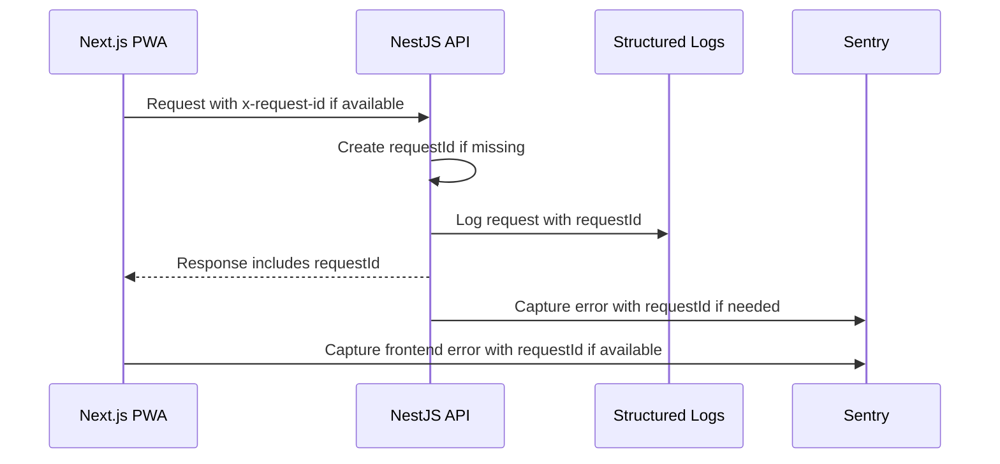

# Error Handling and Logging

## Goal

Errors should be graceful for users and useful for developers. Every serious failure should be traceable through a `requestId` and structured logs.

## User Experience Rules

1. Never show raw stack traces to users.
2. Use clear recovery actions: retry, save locally, print again, sync later.
3. Billing errors must not leave the cashier unsure whether a sale happened.
4. Offline errors should preserve work locally whenever possible.
5. Show a support reference when available, usually the `requestId`.

## API Error Response

Use this shape for API errors:

```json
{
  "success": false,
  "error": {
    "code": "SALE_ALREADY_PROCESSED",
    "message": "This sale was already processed.",
    "details": null
  },
  "requestId": "req_01jz..."
}
```

## Error Code Rules

Error codes should be:

- uppercase
- stable
- specific enough for frontend behavior
- documented when added

Examples:

```text
PRODUCT_NOT_FOUND
INSUFFICIENT_STOCK
SALE_ALREADY_PROCESSED
INVALID_DISCOUNT
INVOICE_GENERATION_FAILED
SYNC_CONFLICT
UNAUTHORIZED_STORE_ACCESS
```

## Backend Logging Rules

Backend logs must be structured JSON. Use Pino through `nestjs-pino`.

Important fields:

```text
level
time
message
requestId
method
route
statusCode
durationMs
userId
storeId
saleId
invoiceId
idempotencyKey
```

Do not log:

- passwords
- auth tokens
- payment secrets
- full customer phone numbers unless explicitly needed and masked
- complete invoice payloads
- raw database connection strings

## Frontend Error Rules

Expected errors should be handled close to the feature.

Examples:

| Error | UI behavior |
| --- | --- |
| Product not found | Show barcode not found and allow manual search |
| Network offline | Save action locally if safe |
| Sync failed | Mark as pending and retry later |
| Print failed | Offer retry and digital invoice |
| Validation failed | Highlight fields and keep user input |

Unexpected errors should be captured by the app-level error boundary and sent to Sentry when configured.

## Request ID Flow



## Database Persistence

`requestId` should be persisted only for important business and support flows. It should not be added blindly to every row in the database.

Persist it in:

| Table/Area | Purpose |
| --- | --- |
| `audit_logs` | User/system action history |
| `sync_events` | Offline sync attempts, retries, failures |
| `idempotency_keys` | Prevent duplicate sale/invoice creation |
| `sales.createdRequestId` | Trace the request that created a sale |
| `invoices.createdRequestId` | Trace the request that created an invoice |
| `stock_movements.createdRequestId` | Trace inventory-changing requests |

For low-risk lookup requests, logs and Sentry are enough. For billing, invoice, stock, and sync operations, database traceability is useful.

## Error Severity

| Severity | Meaning | Example |
| --- | --- | --- |
| Debug | Developer-only detail | SQL timing in local dev |
| Info | Normal important event | Sale created |
| Warn | Recoverable issue | Sync retry failed |
| Error | Action failed | Invoice generation failed |
| Fatal | Service cannot continue | Database unavailable on startup |

## Critical Alerts Later

Create production alerts for:

- repeated sale creation failures
- invoice generation failures
- offline sync backlog growing
- database connection failures
- high 500 error rate
- authentication abuse
- payment/UPI QR generation failures if dynamic QR is added

## Implementation Checklist

When development starts:

1. Add request ID middleware.
2. Add global NestJS exception filter.
3. Add standard API error envelope.
4. Add Pino logger.
5. Add frontend API error parser.
6. Add graceful error components and toast patterns.
7. Add Sentry later when environment/deployment is ready.
8. Keep OpenTelemetry-compatible context fields.
