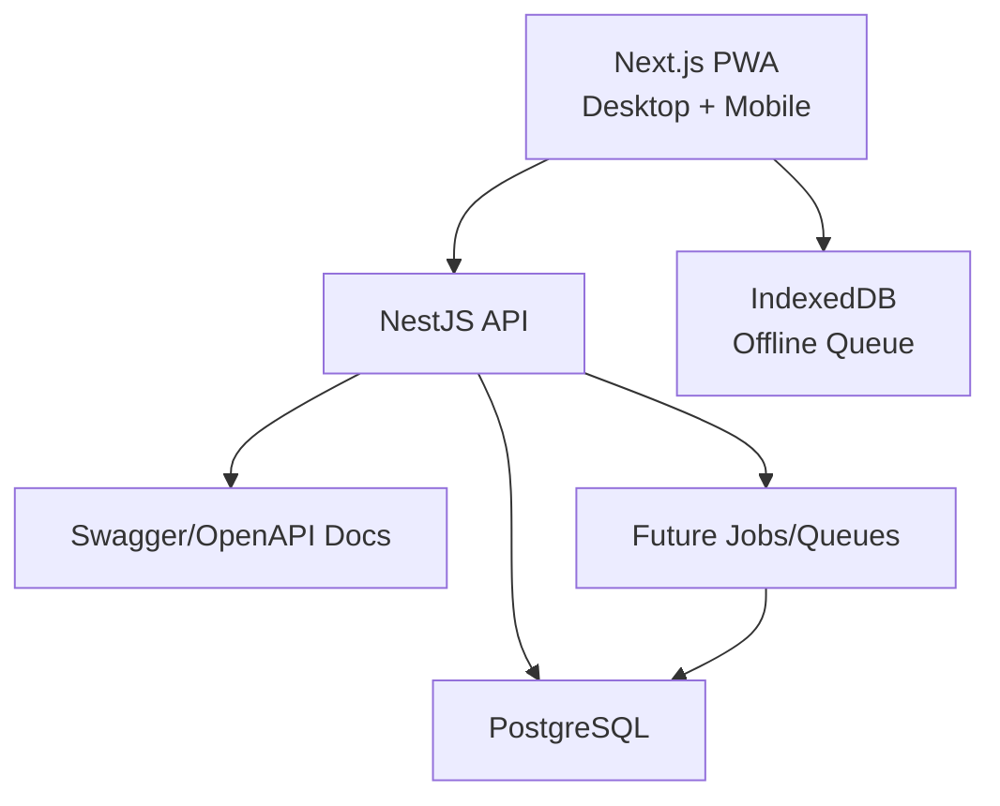
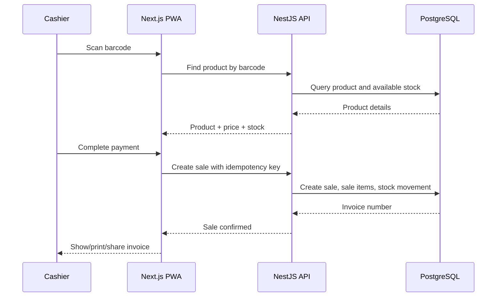
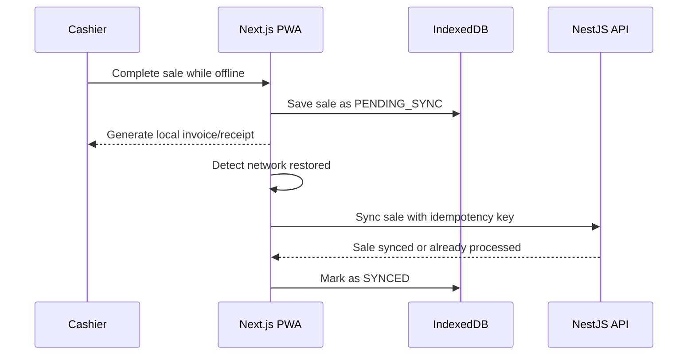
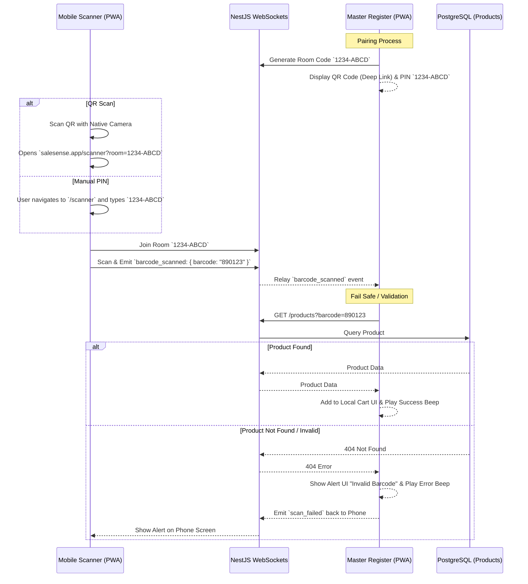
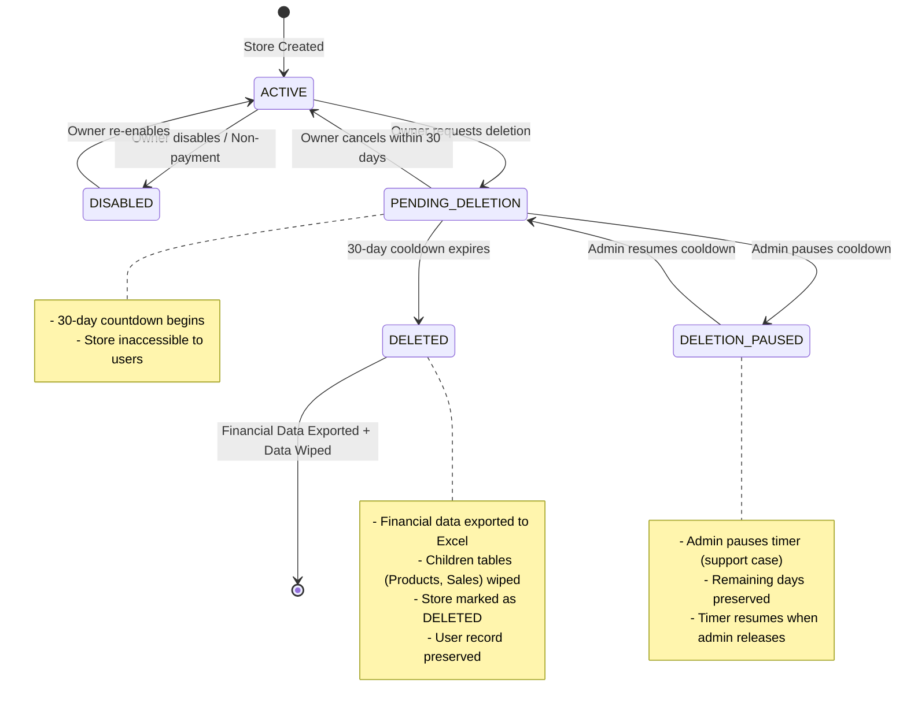

# SaleSense System Design v1

## Goal

Build an installable web-based retail platform for small and medium stores. The first production-grade version must support product catalog, inventory, POS billing, invoices, UPI QR, offline sale capture, sync, analytics, and promotion-profit intelligence.

## Primary Actors

| Actor | Responsibilities |
| --- | --- |
| Owner | Manage store, products, pricing, users, reports, AI insights |
| Cashier | Scan products, bill customers, print/share invoice, accept payment |
| Manager | Manage purchases, stock, expiry, discounts, daily operations |
| Customer | Receives printed, PDF, WhatsApp, or QR-linked invoice |
| System Admin | SaaS-level tenant/support operations |

## Product Tiers

| Tier | Typical Device | Features |
| --- | --- | --- |
| Small shop | Phone | Camera scan, UPI QR, WhatsApp invoice |
| Grocery store | Counter PC | Barcode scanner, thermal print, UPI QR |
| Supermarket | Multiple counters | Users, central inventory, analytics, AI |

## High-Level Architecture



## Core Modules

| Module | Scope |
| --- | --- |
| Auth and Users | Login, roles, store access, cashier/owner permissions |
| Store Management | Store profile, GST number, address, invoice settings |
| Product Catalog | Products, barcode, SKU, category, brand, HSN, tax |
| Inventory | Batches, purchase price, MRP, selling price, expiry, stock movement |
| Purchase Management | Supplier purchases, inward stock, purchase items |
| POS Billing | Scanner input, cart, discounts, tax, payment method, sale completion |
| Invoice | Thermal receipt, GST invoice PDF, QR, print/share |
| Offline Sync | Local pending sale queue, retry, idempotency, conflict handling |
| Customer Management | Customer details, phone, loyalty later |
| Analytics | Revenue, profit, top products, dead stock, margin reports |
| Promotion Engine | Percentage, flat discount, BOGO, bundle analysis |
| AI Advisor | Rule-based first, forecasting and LLM advisor later |

## POS Billing Flow



## Offline Billing Flow



## Companion Scanner Mode (Phone-to-Laptop Sync)

To allow cashiers or warehouse staff to use their mobile phone camera as a wireless scanner for the primary POS laptop, we will implement a lightweight real-time WebSocket relay. The Cart state remains entirely in the laptop's local memory (no database storage required for the cart).



**Impact & Requirements:**
1. **Infrastructure**: The NestJS API must support transient WebSockets (`@nestjs/websockets`). It simply relays messages; it does not store them.
2. **Schema Impact**: **ZERO schema changes required.** Because the cart stays in the laptop's browser memory until checkout, we do not need to alter the database.
3. **Dependencies**: `socket.io` for NestJS and `socket.io-client` for the Next.js frontend.
4. **Fail Safes**: 
   - **Invalid Barcode**: If a barcode is invalid, damaged, or not in the database, the laptop will intercept the error and trigger an alert on *both* the laptop screen and relay an error back to the phone screen.
   - **Network Disconnect**: If the phone loses internet connection (e.g., walking into a dead zone in the warehouse), the phone's UI will instantly turn red with an "Offline" banner. Any scans made while offline will be temporarily queued in the phone's local memory and automatically sent to the laptop the moment the connection is restored.

## Store Lifecycle & Deletion Flow



## Idempotency Rule

Every sale creation request must include a unique idempotency key generated by the client. If the same request is retried, the API must return the original sale instead of creating a duplicate.

Example:

```json
{
  "idempotencyKey": "sale_01jz_local_counter_001",
  "clientInvoiceNumber": "LOCAL-001",
  "status": "PENDING_SYNC"
}
```

## Data Ownership Rules

- Stock is changed only through stock movement records.
- Sale completion creates sale records and stock movement records in one transaction.
- Purchase inward creates inventory batch records and stock movement records.
- Invoice numbers must be generated server-side for synced sales.
- Offline invoices may use local temporary numbers until synced.
- Product price changes should not modify historical sale item prices.

## Testing Gates

Before a feature is accepted:

1. Unit tests for business calculations
2. API tests for successful and failing requests
3. Database migration check
4. End-to-end test for primary user flow
5. Documentation update if behavior changes

## Open Questions

These have current recommendations in `database/0002-database-model-v1.md`.

| Question | Current Recommendation |
| --- | --- |
| Should MVP support only one store per account or multi-store from day one? | Database should be multi-store ready; MVP UI can expose one store. |
| Should invoice numbering be per store, per counter, or global per tenant? | Per store and financial year. Add counter code later only if needed. |
| Should GST be required in MVP or optional per store? | Optional per store, but tax fields should exist from day one. |
| Should offline stock checks warn only, or block billing when local stock is uncertain? | Warn by default. Blocking offline billing can stop the business. |
| Should UPI QR be static merchant QR first or dynamic amount QR? | Static merchant QR in MVP; dynamic amount QR later. |
| Should refunds require manager approval in MVP? | Yes. Refunds should require manager or owner approval. |
| Should customer phone be mandatory for WhatsApp invoice? | No. Customer phone is optional because printed invoices are supported. |
| Should product catalog stay store-specific? | Store-specific for MVP, but keep optional future links to a global catalog. |
| What happens when offline sync creates insufficient stock? | Allow sync, mark affected records for reconciliation, and audit the event. |
