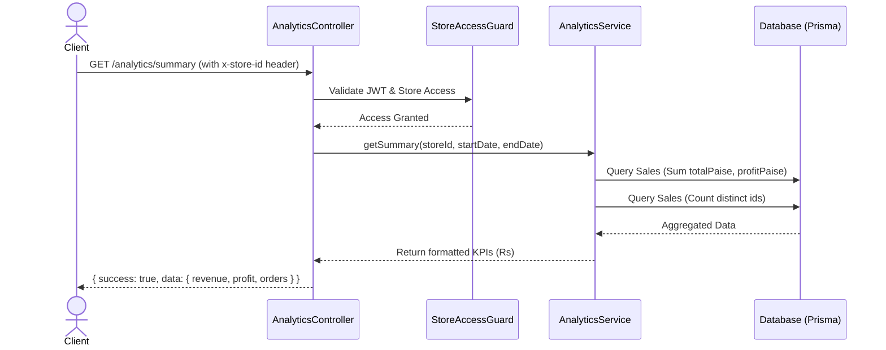
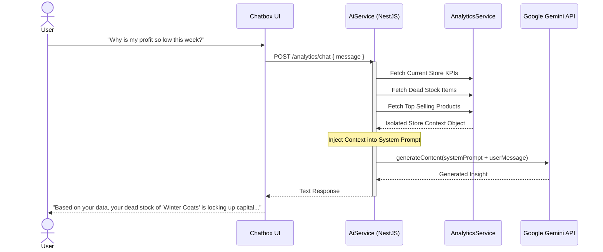
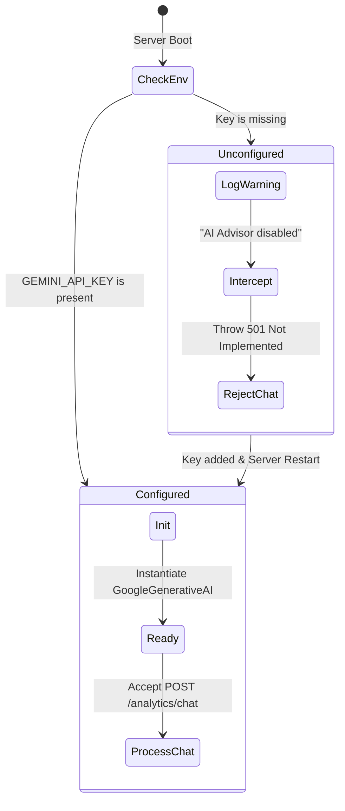

# Analytics & AI System Design

This document outlines the architecture and data flows for the **Phase 4: Analytics and AI Advisor** module in SaleSense.

## 1. Analytics Aggregation Flow

The Analytics service aggregates high-level KPIs and time-series data securely using Prisma queries filtered by `storeId`.

## 2. Secure AI Context-Injection Flow

To prevent data leakage and hallucination, the SaleSense AI Advisor operates as a closed-loop context generator. Instead of allowing the AI unrestricted access to the database or passing the raw user prompt directly to the LLM, the backend intercepts the request and injects isolated store data directly into the system prompt.

## 3. Fallback & Graceful Degradation

If the `GEMINI_API_KEY` is missing in the production environment, the backend gracefully degrades to prevent catastrophic failures.

## Security Considerations
1. **RBAC**: All Analytics endpoints are protected by `StoreAccessGuard`. Only `OWNER` and `MANAGER` roles can access the dashboard.
2. **Data Segregation**: The AI service strictly filters data by `storeId`. Even if a prompt injection attack occurs, the LLM is only aware of the specific store's data explicitly fetched and injected by `AnalyticsService`.
