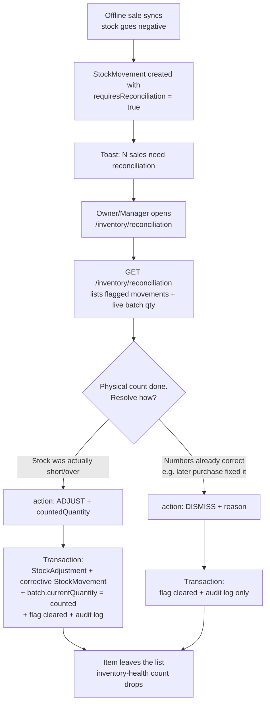

# Inventory Reconciliation Design (P4.1)

## Status

Approved and implemented (2026-07-11). Decisions confirmed: ADJUST/DISMISS semantics,
dedicated `/inventory/reconciliation` page, 30-day expiry window. Tests:
`inventory.service.spec.ts` (reconciliation describe blocks) and
`analytics.service.spec.ts` (inventory-health describe block).

## Goal

Close the loop opened by the offline-sync work (ADR-0004): the system already *flags*
stock movements with `requiresReconciliation = true` when an offline sale drives a batch
negative, and the POS toast tells the owner "N sales need reconciliation" — but there is
nowhere to see or resolve them. This design adds the two endpoints reserved in
`api/0001-api-design-v1.md`, the inventory-health counters promised there
("Low/**expired**/**reconciliation** stock"), and a minimal UI.

## Flow



## Endpoints (paths fixed by `api/0001`)

### `GET /inventory/reconciliation` — Roles: Owner, Manager

Lists stock movements with `requiresReconciliation = true`, newest first, `take: 100`
(same MVP limit as `/inventory/movements`; cursor pagination later if volume demands).

Response item shape:

```json
{
  "movementId": "mov_...",
  "type": "SALE_OUT",
  "quantityDelta": -5,
  "quantityAfter": -4,
  "referenceType": "SALE",
  "referenceId": "sale_...",
  "createdAt": "2026-07-11T10:30:00.000Z",
  "product": { "id": "prod_...", "name": "Amul Milk 500ml" },
  "batch": { "id": "batch_...", "batchNo": "B-102", "currentQuantity": -4 }
}
```

`batch.currentQuantity` is the **live** value (it may have changed since the movement),
so the owner sees what a physical count must be compared against.

### `POST /inventory/reconciliation/:movementId/resolve` — Roles: Owner, Manager

Request body (one of two actions; `reason` always required for the audit trail):

```json
{ "action": "ADJUST", "countedQuantity": 3, "reason": "Physical count after offline oversell" }
```

```json
{ "action": "DISMISS", "reason": "Corrected by purchase PO-118 received yesterday" }
```

Semantics (single transaction):

| Action | Effect |
| --- | --- |
| `ADJUST` | `delta = countedQuantity − batch.currentQuantity`; creates `StockAdjustment` + corrective `StockMovement` (`ADJUSTMENT_IN`/`ADJUSTMENT_OUT`) via the same logic as manual adjustments; sets batch to the counted quantity; clears the flag; writes `audit_log` (`RECONCILIATION_RESOLVED`). If `delta = 0`, no adjustment rows are created — behaves like `DISMISS`. |
| `DISMISS` | Clears the flag; writes `audit_log` with the reason. No stock change. |

Validation rules:

- Movement must belong to the store, have `requiresReconciliation = true`, and have a
  `batchId` (flagged movements always do — they come from batch deductions).
- `ADJUST` requires `countedQuantity` as an integer `>= 0`.
- Resolving an already-resolved movement returns `RESOURCE_NOT_FOUND` (it is no longer
  in the reconciliation set) — idempotent-safe for double-clicks.

### On ledger immutability (design decision)

`stock_movements` is the immutable source of truth for **stock deltas**. Clearing
`requiresReconciliation` does not rewrite stock history — the field is a workflow flag,
which is exactly why the DB model placed it on the movement and why `api/0001` keyed the
resolve endpoint by `:movementId`. Every flip is audit-logged with actor + reason.
*Counterpoint considered:* a separate `reconciliations` table would keep movements
byte-identical forever, but adds a table and a join for MVP-scale benefit. Rejected for
now; revisit if audit/compliance requirements harden.

## Inventory-health additions (additive, non-breaking)

`GET /analytics/inventory-health` response becomes:

```json
{
  "lowStockCount": 3,
  "thresholdUsed": 10,
  "reconciliationCount": 2,
  "expiredCount": 1,
  "expiringSoonCount": 4,
  "expiryWindowDays": 30
}
```

- `reconciliationCount`: movements with `requiresReconciliation = true`.
- `expiredCount`: active batches with `currentQuantity > 0` and `expiryDate < today`.
- `expiringSoonCount`: same but `today <= expiryDate < today + 30 days` (store-timezone
  "today", consistent with ADR-0005 rule 1).
- Low-stock threshold stays hardcoded at 10 for MVP (future: per-store setting).

## Frontend (minimal MVP)

- New page `/(dashboard)/inventory/reconciliation`: table of flagged items (product,
  batch, movement delta, live qty, date, sale link) with per-row **Adjust** (prompts
  counted quantity + reason) and **Dismiss** (prompts reason) actions; sonner toasts on
  success/failure.
- Inventory page header links to it when `reconciliationCount > 0` (badge).
- Analytics inventory-health card shows the new counters.
- New `apps/web/src/lib/api-client/inventory.ts` methods following the
  unwrapped-envelope convention (AGENTS.md invariant 7).

## Blast radius

| Layer | Files | Risk |
| --- | --- | --- |
| API | `inventory.controller/service` (+2 endpoints, additive), new `dto/resolve-reconciliation.dto.ts`, `analytics.service.getInventoryHealth` (additive fields), specs for both | No schema change, no migration. No existing endpoint's shape changes. |
| Web | `api-client/inventory.ts` (+2 methods), `api-client/analytics.ts` (`AnalyticsInventoryHealth` gains optional fields — additive), new reconciliation page, small badge on inventory page, health card | Lockstep with the analytics interface; nothing else consumes it (verified: only `analytics/page.tsx`). |
| Untouched | sales, sync, POS, auth, catalog, purchases, AI | Reads flags only; never sets them. |

Note: no DB index on `requiresReconciliation`; the flagged set is tiny by nature
(exception workflow), so the `(storeId, ...)` scans are fine at MVP volume. Documented
here so it is a known decision, not an oversight.

## Tests (release-rule gate)

- Service: list returns only flagged movements of the store; `ADJUST` creates
  adjustment + movement + sets batch to counted qty + clears flag + audits (mocked
  Prisma transaction, house pattern); `DISMISS` clears + audits without stock rows;
  resolving a non-flagged/foreign movement → not found; `countedQuantity` validation.
- Analytics: inventory-health counts expired/expiring/reconciliation correctly
  (store-timezone boundary case for expiry).

## Open decisions for review

1. **Resolve semantics** — recommended above: `ADJUST | DISMISS`, reason always
   mandatory. Alternative rejected: auto-adjust-only (no dismiss) forces fake counts
   when stock is already correct.
2. **UI placement** — recommended: dedicated `/inventory/reconciliation` page.
   Alternative: a tab on the movements page (fewer files, more clutter).
3. **Expiry window** — 30 days hardcoded (symmetric with the 30-day analytics default).
