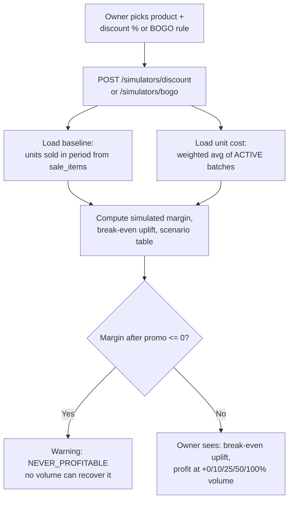

# Promotion Simulators Design (P4.2)

## Status

Approved and implemented (2026-07-11). All five open decisions confirmed as
recommended: weighted-average cost basis, current-price baseline normalization,
fixed scenario steps, dedicated Promotions sidebar page, same-product BOGO only.
Tests: `simulators.service.spec.ts` (10 cases, using the worked shampoo example
from the review discussion).

## Goal

The differentiator per `api/0001`: before a shop owner runs a discount or BOGO offer,
SaleSense answers *"will this make or lose me money, and how much more do I need to
sell to come out ahead?"* — using the store's real cost and sales data, not guesses.

Pure read-side computation: **no schema changes, no writes, no promotion CRUD** (the
`Promotion`/`PromotionRule` tables stay dormant until a later phase, per ADR-0005).

## Flow



## Shared math foundations (both simulators)

All money values are integer **paise**; percentages in/out of the API are **basis
points** (bps, 10% = 1000) to keep requests integer-only. Response `*Pct` fields are
display ratios (not money) rounded to one decimal.

1. **Unit cost `C`** = weighted average `purchasePricePaise` of the product's ACTIVE
   batches with `currentQuantity > 0` — i.e. the stock that would actually be sold
   during the promotion.
   - Fallback 1: the **most recent sale's** `unitPurchasePricePaise`, regardless of the
     lookback period. *(Changed from "within the period" during implementation: dead
     stock — BOGO's primary use case — has by definition no sales inside the period, so
     a period-limited fallback would always miss and produce cost ₹0 → falsely
     profitable results. The latest known cost, however old, is the safer estimate.)*
   - Fallback 2: `0` + warning `NO_COST_DATA` (numbers shown are revenue-only).
2. **Unit price `S`** = product's current `sellingPricePaise`.
3. **Tax is excluded** from all margin math. In the sales flow tax is added on top and
   passed through (`profit = total − tax − cost`), so promotions don't change tax
   economics per unit.
4. **Baseline volume `V0`** = units sold in the lookback period (`periodDays`, default
   30, max 365) from `sale_items` of COMPLETED/PENDING_SYNC sales.
5. **Baseline profit `P0 = (S − C) × V0`** — *normalized to current prices*, not the
   historical `profitPaise` sum. Why: comparing a simulation at today's prices against
   profit earned at last month's prices mixes epochs and corrupts the uplift math.
   (Counterpoint — actual historical profit — rejected for this reason; it stays
   visible in Analytics.)
6. `V0 = 0` → warning `NO_SALES_HISTORY`; per-unit economics still returned,
   break-even/scenario fields null.

## `POST /simulators/discount` — Roles: Owner, Manager

Request:

```json
{
  "productId": "prod_...",
  "discountType": "PERCENTAGE",
  "discountValueBps": 1000,
  "periodDays": 30,
  "expectedUpliftBps": 2500
}
```

- `discountType`: `PERCENTAGE` (`discountValueBps`, 1–10000) or `FLAT`
  (`discountValuePaise`, > 0 and < current price).
- `expectedUpliftBps` optional: owner's own volume guess → adds a `projection`.

Math: `S' = S − discount`, `M1 = S' − C`, `M0 = S − C`.

- Break-even units: `ceil(P0 / M1)`; uplift required = `V_be / V0 − 1`.
- Scenario table at volume uplifts **+0 / +10 / +25 / +50 / +100%**:
  `profit = M1 × round(V0 × (1 + uplift))`, with `profitChangePct` vs `P0`.
- `M1 <= 0` → warning `NEVER_PROFITABLE` (selling below cost; no volume recovers it),
  scenario table still returned so the owner sees the loss magnitude.

Response (shape):

```json
{
  "product": { "id": "...", "name": "..." },
  "baseline": {
    "sellingPricePaise": 3000, "unitCostPaise": 2000, "unitMarginPaise": 1000,
    "periodDays": 30, "unitsSold": 40, "baselineProfitPaise": 40000
  },
  "simulated": {
    "discountedPricePaise": 2700, "unitMarginPaise": 700, "marginChangePct": -30
  },
  "breakEven": { "unitsRequired": 58, "upliftRequiredPct": 45 },
  "scenarios": [
    { "upliftPct": 0, "unitsSold": 40, "profitPaise": 28000, "profitChangePct": -30 },
    { "upliftPct": 25, "unitsSold": 50, "profitPaise": 35000, "profitChangePct": -12.5 }
  ],
  "projection": { "upliftPct": 25, "unitsSold": 50, "profitPaise": 35000, "profitChangePct": -12.5 },
  "warnings": []
}
```

## `POST /simulators/bogo` — Roles: Owner, Manager

MVP scope: **same-product** "buy N get M free" (cross-product bundles later).

Request:

```json
{ "productId": "prod_...", "buyQuantity": 2, "freeQuantity": 1, "periodDays": 30 }
```

Per-bundle economics (`N` paid + `M` free units move per bundle):

- `bundleRevenuePaise = N × S`
- `bundleCostPaise = (N + M) × C`
- `bundleProfitPaise = bundleRevenue − bundleCost`
- `effectiveDiscountPct = M / (N + M)` (as % of retail given away)
- `marginPerUnitMovedPaise = bundleProfit / (N + M)` (floor)
- Break-even bundles to match `P0`: `ceil(P0 / bundleProfit)` — also expressed as
  units moved and uplift vs `V0`.
- `bundleProfit <= 0` → warning `NEVER_PROFITABLE`.
- Extra signal: `hadRecentSales: boolean` — BOGO is typically used to move slow stock;
  a product with zero sales in the period is exactly the dead-stock case Analytics
  flags, and the owner should see that context here.

Response mirrors the discount shape with a `bundle` block instead of `simulated`.

## Validation and errors

- Product must exist, belong to the store, be ACTIVE → else `PRODUCT_NOT_FOUND`.
- `FLAT` discount ≥ current price → `VALIDATION_FAILED` (that's a giveaway, not a
  discount; BOGO models giveaways properly).
- `buyQuantity`, `freeQuantity`: integers ≥ 1, ≤ 100. `periodDays`: 1–365.
- Standard error envelope; no new error codes needed.

## Module and blast radius

| Layer | Files | Risk |
| --- | --- | --- |
| API | **New module** `modules/simulators/` (controller, service, `dto/`, spec) + one registration line in `app.module.ts` | Read-only; zero existing files changed beyond app.module. No schema change, no migration, no idempotency (no writes). |
| Web | New `api-client/simulators.ts`; new page `/(dashboard)/promotions/page.tsx` (product picker + discount/BOGO forms + results panel); one nav entry in `sidebar-nav.tsx` | All additive. Envelope convention (AGENTS.md invariant 7). |
| Untouched | sales, sync, inventory, analytics, AI, auth | Simulators only read `products`, `sale_items`, `inventory_batches`. |

## Tests (release-rule gate)

Mocked-Prisma house pattern, all money in `BigInt` paise:

- Discount: percentage + flat math; break-even ceil; scenario profits; margin-negative
  → `NEVER_PROFITABLE`; no history → `NO_SALES_HISTORY` with null break-even; no
  batches → cost fallback chain + `NO_COST_DATA`; flat ≥ price rejected.
- BOGO: bundle economics (2+1 at S=300/C=200 → bundle profit 0 edge); effective
  discount; break-even bundles; loss-per-bundle warning; `hadRecentSales` flag.
- Store scoping: foreign product → `PRODUCT_NOT_FOUND`.

## Plan vs Implementation (delta record)

| | |
| --- | --- |
| **Prepared earlier (the plan)** | This document as reviewed: two read-only endpoints, shared baseline math (weighted-avg cost, current-price normalization, tax excluded), break-even + fixed scenario table, BOGO bundle economics, warnings, new Promotions page. Five open decisions. |
| **Implemented now** | `modules/simulators/` (controller, service, 2 DTOs, 10-test spec), one `app.module.ts` registration line; web: `api-client/simulators.ts`, `/promotions` page, sidebar entry. All five decisions confirmed as recommended. |
| **Changes vs the plan** | **(a)** Cost fallback widened from "latest sale within the period" to "latest sale ever" — rationale inline above (dead-stock case). **(b)** `expectedUpliftBps` capped at 100000 (+1000%) in the DTO — sanity bound the plan didn't specify. **(c)** `breakEven` is also `null` when the *current* margin is already ≤ 0 (baseline profit ≤ 0) — break-even against a loss-making baseline is meaningless; the plan only covered the discounted-margin case. Everything else implemented exactly as specified. |

## Open decisions for review

1. **Cost basis** — weighted average of active batches, with fallback chain
   (recommended above). Alternative: latest batch only (simpler, less representative).
2. **Baseline normalization** — current-price baseline `P0 = (S−C)×V0` (recommended);
   alternative: historical `profitPaise` sum (rejected — mixes price epochs).
3. **Scenario steps** — fixed +0/10/25/50/100% (recommended); alternative: caller-
   supplied list (more flexible, more validation surface).
4. **UI home** — new "Promotions" sidebar page hosting both simulators (recommended);
   alternative: tab inside Analytics.
5. **BOGO scope** — same-product only for MVP (recommended); cross-product later.
