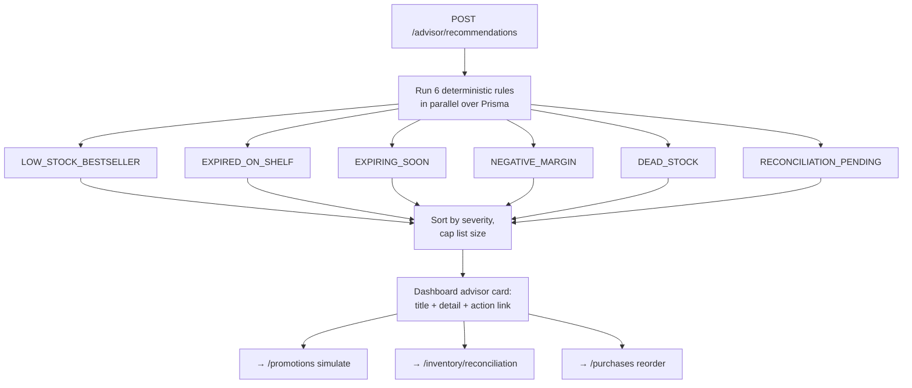

# Rule-Based Advisor Design (P4.3)

## Status

Approved and implemented (2026-07-11). All four open decisions confirmed as
recommended: dashboard advisor card, POST per `api/0001`, the 6-rule MVP set,
caps 5/rule + 20 overall. Tests: `advisor.service.spec.ts` (7 cases).

## Plan vs Implementation (delta record)

| | |
| --- | --- |
| **Prepared earlier (the plan)** | This document as reviewed: 6 deterministic rules, severity model, POST endpoint, dashboard card, standalone Prisma queries, `AdvisorService` exported for P4.4. |
| **Implemented now** | `modules/advisor/` (controller, service with one private method per rule run via `Promise.all`, DTO, 7-test spec) + one `app.module.ts` line; web: `api-client/advisor.ts`, dashboard Advisor card with severity badges and action buttons. |
| **Changes vs the plan** | **(a)** Intra-rule ordering made explicit before the per-rule cap: negative-margin sorts by loss per unit, expiry/dead-stock by cost value at risk — so the cap keeps the most urgent items (plan specified only cross-rule severity ordering). **(b)** The dashboard card hides entirely when the fetch fails (cashiers lack the Owner/Manager role) instead of showing an error state — same best-effort pattern as the P4.1 inventory badge. Everything else implemented exactly as specified. |

## Goal

`api/0001` mandated a rule-based advisor **before** any deeper LLM work: deterministic,
explainable recommendations computed from the store's own data. Where the AI chat
*answers questions the owner asks*, the advisor *tells the owner what they should be
asking about* — unprompted, every time they open the app, no API key required.

Read-only. No schema changes, no writes, no LLM calls.

## Flow



## Endpoint

### `POST /advisor/recommendations` — Roles: Owner, Manager

POST (not GET) to match the contract already published in `api/0001`. Body:

```json
{ "periodDays": 30 }
```

`periodDays` optional (1–365, default 30) — the lookback for sales-based rules.

Response:

```json
{
  "generatedAt": "2026-07-11T12:00:00.000Z",
  "periodDays": 30,
  "recommendations": [
    {
      "code": "LOW_STOCK_BESTSELLER",
      "severity": "HIGH",
      "title": "Reorder Amul Milk 500ml — #2 seller, only 4 left",
      "detail": "Sold 120 units in the last 30 days but current stock covers ~1 day. A stock-out on a bestseller loses guaranteed revenue.",
      "productId": "prod_...",
      "metrics": { "unitsSold": 120, "currentStock": 4, "revenuePaise": 360000 },
      "action": { "label": "View purchases", "href": "/purchases" }
    }
  ]
}
```

- `severity`: `HIGH` (money actively being lost) | `MEDIUM` (money at risk) |
  `INFO` (hygiene). Sorted HIGH → INFO; capped at **5 items per rule, 20 overall**.
- `metrics` is rule-specific; money in integer paise (invariant 1), percentages per
  invariant 8.
- Empty store → `recommendations: []` (the UI shows a healthy-state message).

## The 6 rules (MVP set)

Thresholds reuse the values already established in analytics/design-0005 — one mental
model, documented once: low-stock < 10, expiry window 30 days, top sellers = top 10 by
revenue in period.

| Code | Severity | Trigger | Recommendation & action link |
| --- | --- | --- | --- |
| `LOW_STOCK_BESTSELLER` | HIGH | Product in top-10 revenue for the period AND total active stock < 10 | "Reorder now — bestseller about to stock out" → `/purchases` |
| `NEGATIVE_MARGIN` | HIGH | Current `sellingPricePaise` < weighted-avg batch cost (same cost basis as design-0006) | "You are selling below cost — reprice" → product in catalog |
| `EXPIRED_ON_SHELF` | HIGH | ACTIVE batches, qty > 0, `expiryDate` < today (store timezone) | "Pull from shelf and write off ₹X (cost)" → `/inventory` |
| `EXPIRING_SOON` | MEDIUM | Same but expiring within 30 days | "Discount before expiry — ₹X cost at risk. Simulate an offer" → `/promotions` |
| `DEAD_STOCK` | MEDIUM | Stock on hand, zero sales in period (same definition as analytics dead-stock) | "₹X locked (cost basis) — consider a BOGO to move it" → `/promotions` |
| `RECONCILIATION_PENDING` | INFO | Flagged stock movements exist | "N items need reconciliation" → `/inventory/reconciliation` |

Severity rationale: HIGH = the loss is happening on every transaction or already
happened (below-cost sales, stock-outs on winners, expired goods); MEDIUM = loss is
scheduled but avoidable (expiry approaching, capital locked); INFO = workflow hygiene.

## Module design

- **New `modules/advisor/`** — `advisor.module.ts`, `advisor.controller.ts`,
  `advisor.service.ts` (one private method per rule, run with `Promise.all`),
  `dto/recommendations.dto.ts`, spec.
- **Standalone Prisma queries, no cross-module imports.** The rules need joins the
  analytics methods don't expose (top-seller × stock, price × cost), and importing
  `AnalyticsService` would couple the modules for partial reuse. Counterpoint
  (DRY reuse) rejected: the shared *values* are thresholds, not code paths — they are
  documented here and asserted in tests.
- `AdvisorService` is **exported from the module** deliberately: P4.4 will inject it
  into `AiService` so the LLM chat receives the same recommendations as context.

## Frontend (minimal MVP)

Dashboard (`/(dashboard)/page.tsx`) gains an **"Advisor" card** at the top: severity
badge + title + detail per recommendation, each with its action link; healthy-state
message when empty. New `api-client/advisor.ts`. No new sidebar entry (the advisor
lives where the owner already lands).

## Blast radius

| Layer | Files | Risk |
| --- | --- | --- |
| API | New `modules/advisor/` + one `app.module.ts` line | Read-only; no schema change; no existing endpoint touched |
| Web | New `api-client/advisor.ts`; edit dashboard page (additive card) | Dashboard is the only edited page; verify its current data loads are untouched |
| Untouched | sales, sync, inventory, analytics, simulators, AI | Advisor only reads `products`, `sale_items`, `inventory_batches`, `stock_movements` |

## Tests (release-rule gate)

Mocked-Prisma house pattern: each rule fires on its trigger and stays silent otherwise;
severity ordering; per-rule and overall caps; store-timezone expiry boundary; empty
store → empty list; foreign-store scoping.

## Open decisions for review

1. **UI placement** — dashboard advisor card (recommended: zero navigation, seen every
   session) vs a section on Analytics vs its own page.
2. **HTTP verb** — POST per the published `api/0001` contract (recommended: doc
   consistency) vs GET (more RESTful for a read; would require an api/0001 errata note).
3. **Rule set** — the 6 above for MVP; future candidates (THIN_MARGIN, SLOW_MOVER,
   PRICE_DRIFT vs MRP) deferred until these prove useful.
4. **Caps** — 5 per rule / 20 overall (recommended) to keep the card scannable.
