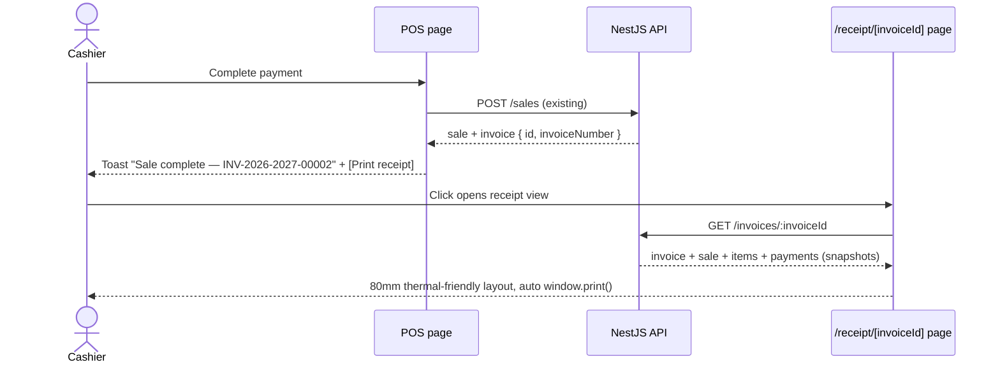

# Invoice Receipt Design (Gate 1 item 7)

## Status

Approved (2026-07-12) with one owner amendment: **digital sharing is in scope, not
deferred** — a paper-free bill saves printing cost (supermarket practice). Resolution:

- **Now**: "Share on WhatsApp" button on the receipt view using a `wa.me` deep link
  carrying a plain-text receipt — zero new dependencies, works immediately. Browser
  "Save as PDF" is also inherent to `window.print()`.
- **Kept on the roadmap (Gate 2, explicitly not removed)**: server-generated PDF
  (`GET /invoices/:id/pdf`) and a public tokenized receipt link so the customer can
  open the bill without store credentials.

Other decisions confirmed as recommended: browser print (80mm-friendly), authenticated
dashboard route, any active store member can reprint.

**Implemented (2026-07-12).** Live E2E at Gate 1 exit: sale → invoice
`INV-2026-2027-00004` → `GET /invoices/:id` returned the full payload with zero
profit/cost leakage (verified programmatically); unknown/foreign invoice → 404.

## Plan vs Implementation (delta record)

| | |
| --- | --- |
| **Prepared earlier (the plan)** | This document: one read endpoint, thermal print view, POS toast integration, digital share amendment. |
| **Implemented now** | `modules/invoices/` (service, controller, 4-test spec) + `app.module.ts` line; web: `api-client/invoices.ts`, `/receipt/[invoiceId]` page (80mm layout, print-only CSS, GST breakup by rate, WhatsApp `wa.me` share button), POS `alert()`s replaced with toasts — success toast carries a **Print receipt** action opening the receipt page. |
| **Changes vs the plan** | None material. Two details: the no-leak rule is enforced by a dedicated test (serialized response must not contain `profitPaise`/`unitPurchasePricePaise`); all three POS alerts (offline-save, success, network-error) became toasts, not just the two the plan named. |

## Goal

A cashier must be able to hand the customer a bill. Today `POST /sales` already
creates a correct `Invoice` row (Indian-FY number, GST/store snapshots) — but the POS
shows a JS `alert()` and the invoice is unreachable afterwards. This design adds the
read endpoint and a print-ready web view. **PDF generation and WhatsApp share stay
deferred** (`api/0001` explicitly allows: "MVP can return receipt data before full PDF
generation exists").

## Flow



## API — new `modules/invoices/` (read-only)

### `GET /invoices/:invoiceId` — Roles: Owner, Manager, Cashier

Returns everything a receipt needs in one call (store-scoped; foreign/missing →
`RESOURCE_NOT_FOUND`):

```json
{
  "id": "inv_...",
  "invoiceNumber": "INV-2026-2027-00002",
  "financialYear": "2026-2027",
  "status": "ISSUED",
  "issuedAt": "2026-07-12T10:30:00.000Z",
  "store": { "nameSnapshot": "...", "addressSnapshot": "...", "gstNumberSnapshot": null },
  "sale": {
    "id": "sale_...", "createdAt": "...", "paymentStatus": "PAID",
    "subtotalPaise": 10000, "discountPaise": 0, "taxPaise": 0, "totalPaise": 10000,
    "items": [
      { "productNameSnapshot": "E2E Test Soap", "hsnCodeSnapshot": null,
        "quantity": 2, "unitSellingPricePaise": 5000, "discountPaise": 0,
        "taxRateBps": 0, "taxPaise": 0, "lineTotalPaise": 10000 }
    ],
    "payments": [ { "method": "CASH", "amountPaise": 10000 } ]
  }
}
```

- Snapshots only — never live product/store data (historical correctness, invariant 4).
- `profitPaise` / cost fields are **stripped** — a customer-facing document must not
  leak margins.
- GST breakup: when `gstNumberSnapshot` exists, the receipt view groups `taxPaise` by
  `taxRateBps` (test-strategy scenario 7). Data already supports it; grouping is a
  view concern.
- `GET /invoices/:id/receipt` and `/pdf` from `api/0001`: deferred — this single
  endpoint carries the full receipt payload; aliases add surface without value now.
  Recorded as an api/0001 errata note.

## Web

1. **New route `/(dashboard)/receipt/[invoiceId]`** — thermal-friendly layout
   (~80mm width, monospace-ish, store header, item lines, totals, GST breakup when
   present, payment method, footer "Thank you"). `@media print` CSS hides app chrome;
   a Print button calls `window.print()`.
2. **POS change**: replace both `alert()` calls. Online success → sonner toast with an
   action button "Print receipt" opening `/receipt/{invoiceId}` in a new tab. Offline
   queue path → toast (no invoice exists yet — server invoice prints after sync;
   offline local receipt is a Gate 2 item, recorded).
3. New `api-client/invoices.ts` (envelope convention).

## Blast radius

| Layer | Files | Risk |
| --- | --- | --- |
| API | New `modules/invoices/` (controller, service, spec) + one `app.module.ts` line | Read-only; no schema change; nothing existing modified |
| Web | New receipt page + `api-client/invoices.ts`; edit POS success/queue handlers (alert → toast+link) | POS edit is localized to `completeSale` |
| Untouched | sales creation, sync, inventory, analytics, advisor, simulators | Receipt only reads what sales already wrote |

## Tests

- Service: returns scoped invoice with items/payments; strips profit/cost fields;
  foreign store / unknown id → `RESOURCE_NOT_FOUND`.
- Manual E2E before Gate 1 exit: sale → toast → receipt page renders → print preview.

## Open decisions for review

1. **Print approach** — browser `window.print()` on an 80mm-styled page (recommended;
   works with thermal printers via the OS driver and with A4) vs ESC/POS raw printing
   (needs device integration — Gate 2+ if a pilot store's printer demands it).
2. **Route placement** — inside `(dashboard)` group so auth context applies
   (recommended) vs a public tokenized receipt link (customer-shareable — defer;
   sharing is the WhatsApp/PDF feature).
3. **Reprint access** — any Owner/Manager/Cashier of the store can open any invoice's
   receipt by id (recommended; ids are UUIDs, auth still required) vs cashier-only-own-sales.
