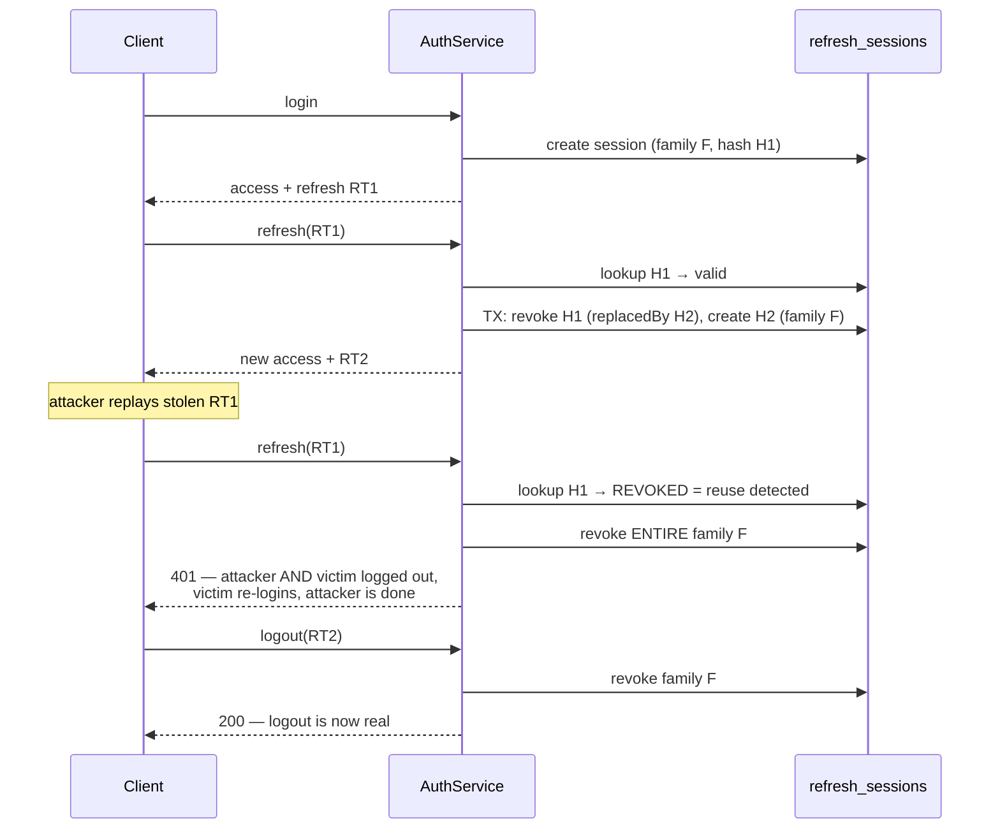

# Security Hardening Design (Gate 2 Wave B)

## Status

Approved (2026-07-12) — scope and approach reviewed in the Gate 2 deep-dive discussion
and approved by the owner ("go ahead with wave B"). Covers Gate 2 items 1 (refresh
tokens) and 2 (scanner WebSocket).

## Part 1 — Refresh-token rotation, revocation, theft detection

### The problem

Refresh tokens today are stateless 7-day JWTs: logout is purely client-side, a stolen
token cannot be killed, and `refresh()` doesn't even rotate — the same token works for
its full week. Bonus defect: refresh JWTs carry no `jti`, so two same-second logins
mint byte-identical tokens.

### Design

New table `refresh_sessions` — the server-side record that makes revocation possible
(first post-baseline migration, applied via `prisma migrate deploy`):

| Field | Purpose |
| --- | --- |
| `tokenHash` (unique) | SHA-256 of the refresh token — the raw token is never stored |
| `familyId` | Groups a login's rotation chain — theft response revokes the family |
| `revokedAt`, `replacedById` | Rotation lineage; a *revoked* hash reappearing = reuse |
| `expiresAt` | Mirrors the JWT `exp` for cheap DB-side filtering |

Rules:

1. `refresh` = verify JWT signature → hash lookup → unknown hash 401 · revoked hash =
   **reuse → revoke family** · valid → rotate in one transaction (new session, old one
   revoked + linked).
2. `logout` accepts the refresh token and revokes its family server-side; the client
   then clears storage. Missing token → still 200 (client-side-only logout remains
   possible).
3. Refresh JWTs gain a `jti` (uuid) — hash uniqueness guaranteed.
4. Opportunistic hygiene: expired sessions for the user are deleted on login.

### localStorage reconsidered (checklist wording) — decision

Refresh tokens **stay in localStorage for now**; the httpOnly-cookie migration is
deferred until the deployment topology is known. Why: cross-origin cookies
(Vercel↔Railway) require `SameSite=None; Secure` + CSRF handling — real complexity,
brittle on plain-HTTP LAN setups pilots may use. Rotation + reuse detection shrinks the
XSS blast radius from "7 silent days" to "until the victim's next refresh, then the
family burns". Revisit when the apex domain is chosen (same-site makes cookies cheap).

## Part 2 — Scanner WebSocket hardening

### The constraint that shapes the design

The phone scanner is **deliberately login-free** (`system-design/0001`): the cashier's
phone scans a QR and starts scanning — zero-friction is the feature. So the fix is NOT
"require login on the phone"; it is "make rooms unguessable and ungate-crashable":

| Measure | Detail |
| --- | --- |
| Authenticated room creation | New `create_room` event: only a socket that presented a **valid JWT** in the Socket.IO handshake (`auth.token`) may register a room — the POS laptop is logged in, so this is free. Attackers cannot camp arbitrary PINs. |
| Unguessable codes | POS generates the room code with `crypto.getRandomValues` — 8 chars from an unambiguous A–Z/2–9 alphabet ≈ 40 bits (vs 6-digit `Math.random`). |
| Join gating | `join_room` (still PIN-only for the phone) succeeds **only if the room exists**; each miss increments a per-socket counter — 5 failures → disconnect. Brute force needs ~2^39 sockets. |
| Origin allowlist | Gateway CORS from `CORS_ORIGIN` env (was `'*'`). |
| Room lifecycle | Laptop disconnect tears the room down. |

Phone flow is unchanged: scan QR / type code → `join_room` → scan barcodes.

## Blast radius

| Layer | Files | Risk |
| --- | --- | --- |
| DB | `schema.prisma` + migration `add_refresh_sessions` (one new table, one relation on User) | Additive; applied via `migrate deploy` — the migration workflow's first real use |
| API | `auth.service/controller` (+ logout dto), `scanner.gateway`, `scanner.module` (JwtModule import) | `refresh` response unchanged shape (adds `refreshToken`); logout body optional → backward compatible |
| Web | `auth-context` (logout sends token; refresh flow in `client.ts` stores rotated token), POS socket init (crypto PIN, handshake auth, `create_room`) | Scanner phone page untouched |
| Untouched | sales, inventory, analytics, advisor, simulators, invoices | — |

## Tests

- Auth: rotation creates new session + revokes old with lineage; revoked-hash reuse
  revokes the whole family; unknown hash 401; logout revokes family; login creates
  session with `jti`d token.
- Gateway: manual live verification (authenticated create, unauthenticated create
  rejected, join of nonexistent room rejected, 5-strike disconnect).
- Live E2E: login → refresh(RT1) → refresh(RT1) again → 401 AND RT2 also dead (family
  revoked) — the full theft story exercised against the real DB.
