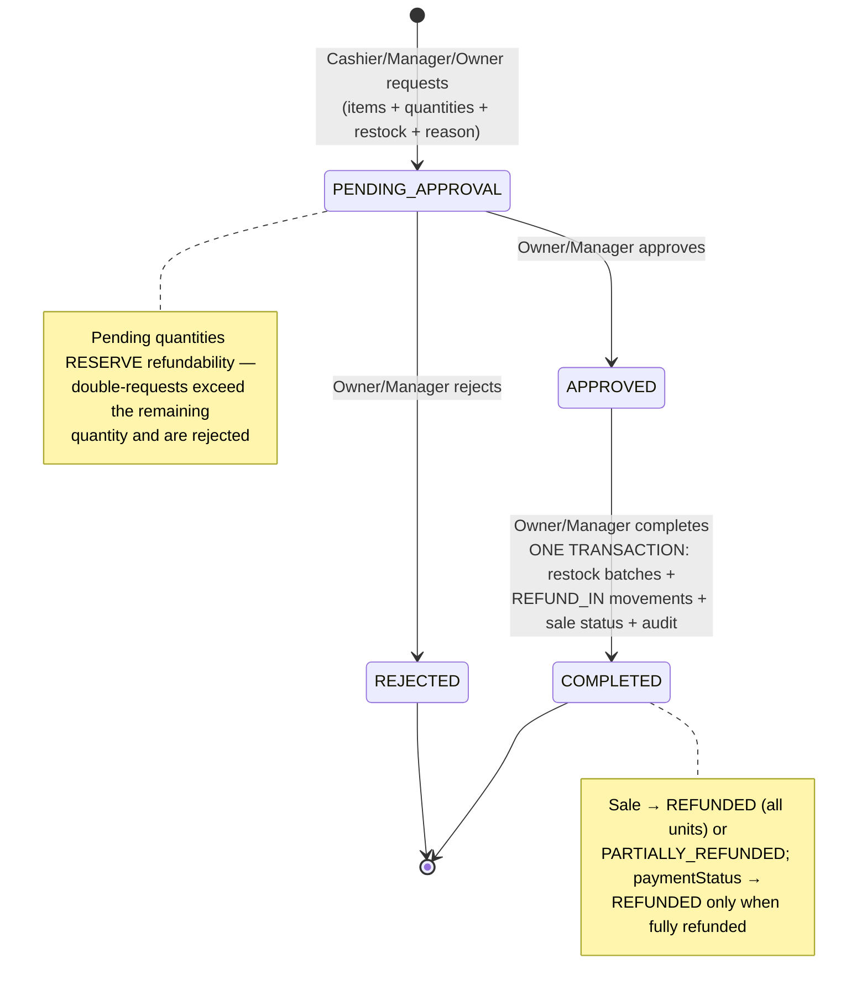

# Refunds & Sales History Design (Gate 2 Wave C, part 1)

## Status

Approved and implemented (2026-07-12) — approach reviewed in the Gate 2 deep-dive and
approved by the owner ("go ahead with wave C"). Implements the refund workflow the
schema has carried since day one (`Refund`, `RefundItem`, `RefundStatus`, approval
fields — `db 0002`, `api 0001`).

Live E2E at exit (real DB): sell 2 → batch 5→3 → request 1 (amount ₹50 computed
server-side) → approve → complete → batch 4 + `REFUND_IN` movement + sale
`PARTIALLY_REFUNDED` → refund 2nd → sale `REFUNDED` + `paymentStatus REFUNDED` +
batch 5 → over-refund attempt → 400. Tests: `refunds.service.spec.ts` (10 cases).

## Plan vs Implementation (delta record)

| | |
| --- | --- |
| **Prepared earlier (the plan)** | This document: sales history endpoints, refunds module with approval state machine, server-side amounts, reservation rule, transactional complete. |
| **Implemented now** | `GET /sales` + `GET /sales/:saleId` (with `refundableQuantity`); `modules/refunds/` (dto, service, controller, module, 10-test spec); web: `/sales` list + `/sales/[saleId]` detail with refund request form and role-gated approve/reject/complete, sidebar "Sales" entry, refunds + sales client types. |
| **Changes vs the plan** | None material. One detail: batch archived/missing at complete time → that item's restock is skipped silently (manual stock adjustment is the fallback) rather than failing the whole refund — the customer's money must not be blocked by inventory bookkeeping. |

## The dependency the audit exposed

There is no `GET /sales` — a cashier has nowhere to *find* the sale to refund. So this
design ships sales history first: list + detail endpoints and a Sales page.

## Flow

## Endpoints

### Sales history (new on the existing sales module)

| Route | Roles | Returns |
| --- | --- | --- |
| `GET /sales` | Owner, Manager | Latest 100 sales: totals, payment status, invoice number, refund summary |
| `GET /sales/:saleId` | Owner, Manager, Cashier | Full detail: items **with `refundableQuantity` precomputed**, payments, invoice, refunds |

### Refunds (new module)

| Route | Roles | Effect |
| --- | --- | --- |
| `POST /sales/:saleId/refunds` | all three | Creates `PENDING_APPROVAL` refund; amounts computed **server-side** |
| `GET /refunds`, `GET /refunds/:id` | Owner, Manager | List (latest 100) / detail |
| `POST /refunds/:id/approve` \| `/reject` | Owner, Manager | `PENDING_APPROVAL` only, else 409 |
| `POST /refunds/:id/complete` | Owner, Manager | `APPROVED` only, else 409 `REFUND_APPROVAL_REQUIRED` |

## Business rules (the rigor)

1. **Refundable quantity** per sale item = sold − Σ quantities in refunds **not**
   REJECTED/CANCELLED (pending requests reserve stock — the same soap cannot be
   refund-requested twice).
2. **Amounts are never client-supplied.** Per item:
   `refundAmountPaise = lineTotalPaise × qtyRefunded / qtySold` (BigInt floor — the
   line total already embeds discount and tax proportionally; flooring the remainder
   paise favors the store; documented).
3. **Refundable sales**: status `COMPLETED` or `PARTIALLY_REFUNDED` only.
4. **Complete = one transaction** (the sale transaction in reverse): per item with
   `restock=true` **and** a `batchId` → batch `currentQuantity += qty` + `REFUND_IN`
   stock movement (`referenceType: REFUND`, `quantityAfter`); items sold without a
   batch restock nothing (no batch to return to). Then sale status → `REFUNDED` when
   every sold unit is in COMPLETED refunds, else `PARTIALLY_REFUNDED`; `paymentStatus →
   REFUNDED` only when fully refunded. Audit log at every transition
   (`REFUND_REQUESTED/APPROVED/REJECTED/COMPLETED`) with `requestId`.
5. **Idempotency = the state machine** (documented deviation from `api/0002`'s
   key-based scheme, which awaits the deferred `idempotency_keys` table): approving an
   already-approved refund → 409; completing a completed one → 409; double-*requests*
   are bounded by rule 1. Retry-safe without the table.

## Web

- **New `/sales` page** (sidebar: "Sales", History icon): latest sales with invoice
  number, time, total, payment status, refund badge; row links to detail.
- **`/sales/[saleId]` detail**: items with refundable quantities, receipt link, refund
  request form (per-item quantity + restock toggle + reason), refund list with
  approve/reject/complete actions (shown by role from the auth context; server
  enforces regardless).

## Blast radius

| Layer | Files | Risk |
| --- | --- | --- |
| API | `sales.controller/service` (+2 read endpoints, additive), **new `modules/refunds/`**, `app.module.ts` line | No schema change — the tables have existed since Phase 0. No existing endpoint reshaped. |
| Web | New `api-client/refunds.ts` + sales additions, 2 new pages, sidebar entry | POS untouched |
| Untouched | sync, inventory, analytics, advisor, simulators, invoices, auth | Refund stock movements reuse the existing immutable-ledger invariants |

## Tests

Refunds service (mocked-Prisma house pattern): over-refund rejected (incl. pending
reservations), foreign sale/refund → not found, amount proportionality math, approve /
reject transitions + wrong-state 409s, complete → restock movement + batch increment +
sale `PARTIALLY_REFUNDED`→`REFUNDED` progression, restock=false and no-batch items move
no stock. Sales history: store scoping + refundable computation. Live E2E at exit:
sell 2 → refund 1 (approve → complete) → batch +1, movement `REFUND_IN`, sale
`PARTIALLY_REFUNDED` → refund the 2nd → `REFUNDED` → over-refund attempt → 400.
