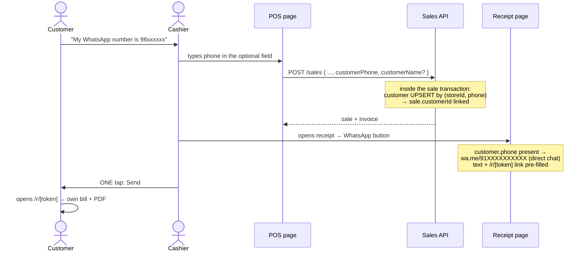

# Customers & WhatsApp-to-Customer Design (Gate 2 Wave C.3)

## Status

Approved and implemented (2026-07-13). Live E2E: sale with a phone → customer created
and linked → second sale, same phone → SAME customer id (no duplicate) → search finds
her → private receipt carries `{name, phone}` → public `/r/` payload verified
phone-free. Tests: +7 (customers CRUD/scoping, sale capture with/without phone,
public-payload privacy) — API suite 118.

## Plan vs Implementation (delta record)

| | |
| --- | --- |
| **Prepared earlier (the plan)** | This document: phone capture on the sale DTO, upsert inside the sale transaction, customers module, wa.me direct chat, public-payload privacy, Cloud API deferred. |
| **Implemented now** | All of it: DTO fields, tx upsert, `modules/customers/` (list/search, create for all roles, get/update Owner-Manager), `/customers` page (fixing the dead sidebar link), POS phone input, receipt button becomes "WhatsApp <name>" opening the customer's chat. |
| **Changes vs the plan** | None material. Detail: the POS input accepts any format and normalizes to digits client-side; a 10-digit number is assumed Indian (`91` prefix) at wa.me time only — stored numbers keep the raw digits. |

Approved (2026-07-13) — scope agreed with the owner: the **free** delivery path now
(phone capture → sale links customer → `wa.me/<phone>` opens the customer's chat
directly, one Send tap, ₹0 per bill); the **WhatsApp Cloud API** (zero-tap automation,
₹0.12–0.35/bill via BSP) is a **post-pilot opt-in behind env config** — recorded here
so it is a decision, not a gap. Unofficial WhatsApp automation (whatsapp-web.js et al.)
is rejected permanently: ToS violation, number-ban risk.

## Flow

## Pieces

### 1. Customer capture on the sale (works offline too)

`CreateSaleDto` gains optional `customerPhone` (8–15 digits) and `customerName`.
Inside the existing sale transaction: `customer.upsert` on the `(storeId, phone)`
unique → `sale.customerId` linked. Why on the DTO rather than a separate lookup call:
**offline sales carry the phone in the queued payload** and the customer is
created/linked at sync time — a pre-lookup endpoint would break the offline flow.
`customerId` (already in the DTO) still wins when supplied explicitly.

### 2. Customers module (api/0001 contract)

| Route | Roles |
| --- | --- |
| `GET /customers` (search by name/phone, latest 100) | Owner, Manager |
| `POST /customers` | all three |
| `GET /customers/:id` | Owner, Manager |
| `PATCH /customers/:id` | Owner, Manager |

No schema change — the `Customer` table has existed since Phase 0. Loyalty points
stay untouched (display only; earning rules are a future feature).

### 3. Receipt → direct chat

- Authenticated `GET /invoices/:id` payload gains `customer: { name, phone } | null`.
- **The public `/r/[token]` payload deliberately excludes the customer** — the link
  may be forwarded; a bill viewer should not see the buyer's phone number.
- Receipt page WhatsApp button: phone present → `wa.me/<normalized>` (strip
  non-digits; 10 digits → prefix `91`) opening the exact chat; otherwise the existing
  contact-picker fallback.

### 4. Customers page

The sidebar has linked `/customers` since Phase 1 — **the page never existed** (dead
link found in this design's pre-flight). New page: search, list (name, phone, loyalty
points, joined date), inline create.

### 5. Deferred (recorded decision)

WhatsApp Cloud API integration: post-pilot, opt-in per store, behind
`WHATSAPP_API_KEY`-style env config, sending a utility template with the `/r/` link.
The receipt payload and public link already exist, so it bolts on cleanly.

## Blast radius

| Layer | Files | Risk |
| --- | --- | --- |
| API | `create-sale.dto` (+2 optional fields), `sales.service` (upsert inside existing tx), `invoices.service` (+customer in private payload only), **new `modules/customers/`**, `app.module.ts` line | No schema change; sale flow change is additive and skipped entirely when no phone is given |
| Web | POS (+1 optional input), receipt page (wa.me upgrade), new `/customers` page + client, sales payload type | Offline queue payload shape unchanged (new optional fields ride along) |
| Untouched | refunds, inventory, analytics, advisor, simulators, auth, scanner | — |

## Tests

Customers service CRUD + scoping; sales service: sale with `customerPhone` upserts and
links the customer / without phone touches nothing; invoices: customer present in the
private payload, **absent from the public payload**. Live E2E: sale with a phone →
customer created → second sale, same phone → same customer id linked (no duplicate).
