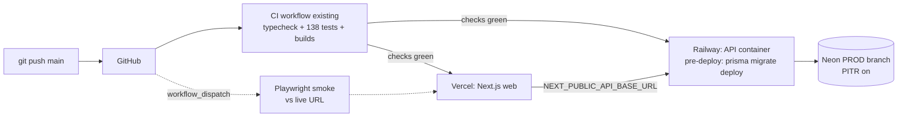

# Pilot Deployment Design (Gate 2 exit → live pilot)

## Status

Draft for review — **no implementation until approved** (AGENTS.md pre-flight rule 3).
Several steps require **owner-performed actions** (creating accounts, connecting the
GitHub repo, pasting secrets) — marked 👤 below; I cannot and should not do those.

## Topology

## CI/CD decision (owner question, recorded)

**CI**: already exists (`.github/workflows/ci.yml`, Wave A) — unchanged, it becomes the
deploy gate. **CD**: platform-native Git integration, NOT a custom deploy Action —
Vercel/Railway auto-deploy on push with **"wait for CI checks"** enabled, so a red
build never ships. Rationale per the docs' decision rule: a hand-rolled deploy workflow
duplicates what the platforms do natively, adds deploy tokens to GitHub secrets, and
adds YAML to maintain — rejected. The **only new Action**: a manually-triggered
post-deploy Playwright smoke.

## Platform choices

| Piece | Choice | Why / counterpoint |
| --- | --- | --- |
| API host | **Railway** | Monorepo-friendly, pre-deploy command support, wait-for-CI, usage pricing (~$5/mo hobby covers a pilot). *Counterpoint: Render is equivalent — free tier sleeps after idle (bad for a POS counter); use Render only if Railway pricing displeases.* |
| Web host | **Vercel** | First-party Next.js host; free hobby tier; preview deploys per PR. |
| DB | **Neon production branch** | Same project, new branch `production` — dev data (incl. E2E debris) stays on dev; PITR/backups on. |
| Errors | Sentry (already wired) | 👤 create the two DSNs; paste into env. |

## Artifacts to add (my implementation scope)

### 1. `apps/api/Dockerfile`

Multi-stage, pnpm+corepack aware:
build stage: corepack enable → `pnpm install --frozen-lockfile` → prisma generate →
build shared/db packages → `nest build`; runtime stage: node:24-slim, production deps
only, `CMD ["node", "dist/src/main.js"]` (the monorepo outputs to `dist/src/` — noted
in AGENTS since Phase 1). `EXPOSE 4000`. Healthcheck hits `/api/v1/health` (public
since Gate 1).

### 2. Railway pre-deploy command

`corepack pnpm --filter @salesense/db db:deploy` — migrations run against prod before
the new container takes traffic. First deploy applies `0_init` + `refresh_sessions` to
the fresh prod branch.

### 3. `.github/workflows/smoke.yml`

`workflow_dispatch` (manual trigger from the Actions tab): installs Playwright
browsers, runs `pnpm --filter @salesense/web test:e2e` with `E2E_BASE_URL`,
`E2E_EMAIL`, `E2E_PASSWORD` from repo secrets. Green = the live deployment serves
login → dashboard → sales, and the public receipt page rejects tampered tokens.

### 4. Docs: `developer-reference/deployment-runbook.md`

Step-by-step 👤 owner checklist (below) so go-live is reproducible without this chat.

## Environment matrix

| Var | Railway (API) | Vercel (web) |
| --- | --- | --- |
| `DATABASE_URL` | Neon **prod branch** pooled URL | — |
| `JWT_SECRET`, `JWT_REFRESH_SECRET` | 32+ random bytes each, fresh (never reuse dev) | — |
| `NODE_ENV` | `production` (activates fail-fast, hides Swagger) | auto |
| `CORS_ORIGIN` | the Vercel URL (e.g. `https://salesense.vercel.app`) | — |
| `GEMINI_API_KEY` | optional (chat 501s gracefully without) | — |
| `SENTRY_DSN` / `NEXT_PUBLIC_SENTRY_DSN` | API DSN | web DSN |
| `NEXT_PUBLIC_API_BASE_URL` | — | `https://<railway-app>.up.railway.app/api/v1` |

Boot safety already built: production refuses to start if `DATABASE_URL`/JWT secrets
are missing (Gate 1 item 3).

## 👤 Owner actions (in order)

1. Neon console → create branch `production` from a **clean point or empty** (decision
   below), enable PITR. Copy pooled connection string.
2. Railway → New Project → Deploy from GitHub repo → root `apps/api` Dockerfile; set
   env vars; set pre-deploy command; enable **Wait for CI**.
3. Vercel → Import repo → root directory `apps/web`; set env vars; auto-deploy on main.
4. Update `CORS_ORIGIN` on Railway with the final Vercel URL (and redeploy).
5. Sentry → two projects (node + nextjs) → paste DSNs.
6. GitHub repo secrets: `E2E_BASE_URL`, `E2E_EMAIL`, `E2E_PASSWORD` (a seeded pilot
   user) → run the smoke workflow.
7. 30-minute UAT: the eight critical scenarios in `testing/0001-test-strategy.md`.

## Open decisions for review

1. **Railway vs Render** for the API — Railway recommended (no sleep, pre-deploy cmd).
2. **Prod data start**: empty production branch + register the pilot store fresh
   (recommended — dev data contains E2E debris) vs branching current dev data.
3. **Custom domain now or later** — later recommended; Vercel/Railway URLs suffice for
   a pilot, and the cookie/CSRF topology decision (design-0010) reopens when a real
   apex domain exists.
4. **Gemini in prod** — include the key from day one (chat is cheap at pilot volume,
   throttled 10/min) or leave it off initially.

## Blast radius

New files only (`Dockerfile`, `smoke.yml`, runbook doc) — zero changes to app code.
The repo stays fully runnable locally exactly as before.
